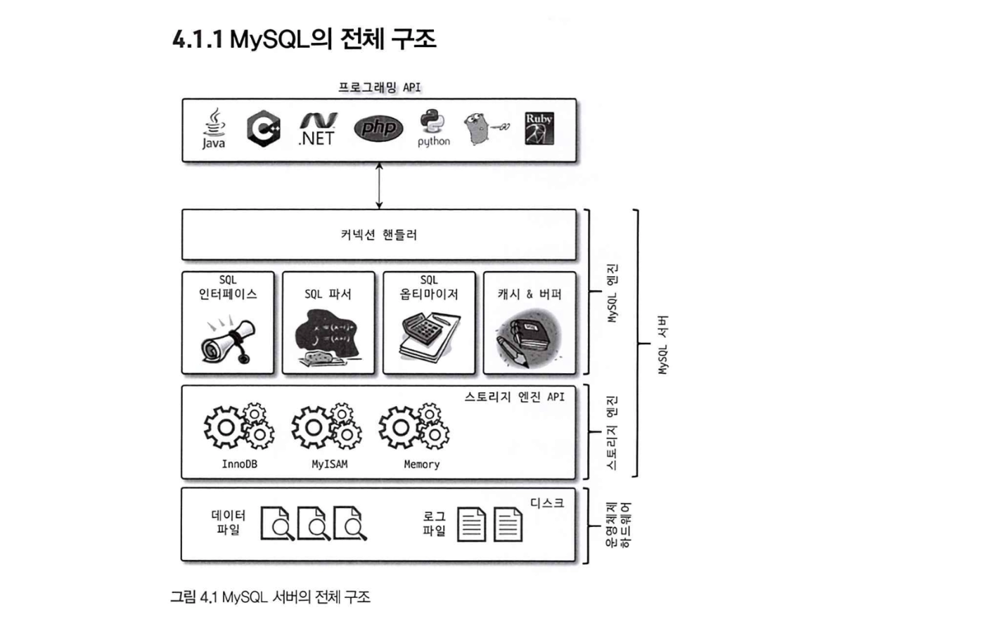
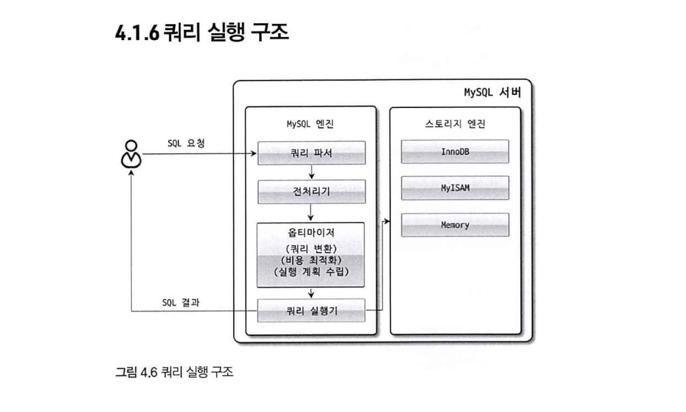

# MySQL 기본 구조와 실행 계획 

## 학습 목표
- MySQL이 SQL 요청을 받아 처리하는 전체 흐름을 이해한다.
- 특히 MySQL 엔진, 스토리지 엔진, 옵티마이저의 역할을 구분하고, EXPLAIN을 통해 옵티마이저가 선택한 실행 계획을 확인해본다.

## 핵심 흐름
아키텍처 전체 흐름 이해 → 옵티마이저가 어떤 역할을 하는지 파악 → EXPLAIN으로 옵티마이저의 판단 결과 확인

## 왜 옵티마이저를 알아야 할까?

- 옵티마이저는 사용자가 작성한 SQL을 실제로 어떻게 실행할지 결정한다.
- 같은 결과를 반환하는 쿼리라도 MySQL은 여러 실행 방법을 선택할 수 있다.
    - 예를 들어 전체 테이블을 읽을 수도 있고, 인덱스를 이용해 일부 데이터만 찾을 수도 있다.
- 이때 어떤 방식이 더 효율적인지 판단하고 실행 계획을 세우는 것이 옵티마이저의 역할이다.
- **따라서 쿼리 성능을 개선하려면 단순히 SQL 문법만 아는 것이 아니라, MySQL이 그 쿼리를 어떻게 실행하려고 하는지 확인할 수 있어야 한다.**

---

## MySQL 서버 구조



MySQL 서버는 크게 두뇌 역할을 하는 MySQL 엔진과, 손발 역할을 하는 스토리지 엔진으로 구성된다.

```
[ MySQL 서버 ]
│
├─ [ 🧠 MySQL 엔진 ] : 요청 분석, 최적화 및 전체적인 실행 제어
│   ├─ 커넥션 핸들러 : 클라이언트 연결 및 요청을 관리
│   ├─ SQL 파서 & 전처리기 : SQL 문법 및 구조 검사
│   ├─ 옵티마이저 : 최적의 실행 계획 결정
│   └─ 실행 엔진 : 실행 계획에 따라 스토리지 엔진에 작업 요청
│
│       ⬇️ 핸들러 API (Handler API)
│
└─ [ ✋ 스토리지 엔진 ] : 실제 데이터 디스크 I/O 처리 (InnoDB, MyISAM 등)
```


### MySQL 엔진
- 요청된 SQL 문장을 분석하거나, 최적화하는 등 DBMS의 두뇌에 해당하는 처리를 수행한다. 
- 하나의 MySQL 서버에는 하나의 MySQL 엔진만 존재한다.

### 스토리지 엔진
- 실제 데이터를 디스크 스토리지에 저장하거나, 디스크 스토리지로부터 데이터를 읽어온다. (예: InnoDB, MyISAM 등) 
- MySQL 엔진과 달리, 여러 개의 스토리지 엔진을 동시에 사용할 수 있다.

### 핸들러 API

- MySQL 실행 엔진이 데이터를 읽거나 저장해야 할 때, 스토리지 엔진에 보내는 요청을 핸들러 요청이라 한다.
- MySQL 엔진은 직접 데이터를 저장하거나 읽지 않는다.
- 대신 핸들러 API를 통해 스토리지 엔진에게 '데이터를 읽어 와', '데이터를 저장해'와 같은 작업을 요청한다.
- 즉, 핸들러 API는 MySQL 엔진과 스토리지 엔진이 서로 작업을 주고받기 위한 통로(인터페이스) 역할을 한다.

## 쿼리 실행 구조



사용자가 SQL을 요청하면 MySQL은 단순히 바로 데이터를 조회하지 않는다. <br>
먼저 SQL 문장을 해석하고, 실행 가능한 형태로 분석한 뒤, 가장 효율적인 실행 방법을 결정한다. <br>
이후, 실행 엔진이 스토리지 엔진에게 실제 데이터 조회 및 저장 작업을 요청한다.

즉, MySQL은 다음과 같은 흐름으로 쿼리를 처리한다.

> 1. 파서가 들어온 쿼리 문장에 대해, 문법을 확인하고, 적절한 단위로 나누어 파서 트리를 만든다.
> 2. 전처리기가 앞에서 만들어진 파서 트리를 보고, 구조적으로 문제가 있는지 확인한다. (ex. 없는 테이블에 접근)
> 3. 옵티마이저가 요청받은 쿼리를 어떻게 하면 가장 적은 비용으로 빠르게 처리할지를 결정한다.
    - 개발자가 해야 할 일은 옵티마이저가 더 나은 결정을 할 수 있도록 쿼리를 작성하는 것
> 4. 실행 엔진은 옵티마이저에 의해 결정된 실행 계획대로 핸들러에게 지시한다.
> 5. 핸들러(스토리지 엔진)는 실행 엔진이 내려준 지시대로 작업을 수행한다.

### 쿼리 파서 (Query Parser)

- 사용자 요청으로 들어온 SQL 문장을 MySQL이 이해할 수 있는 최소 단위(토큰)로 분리하고, 이를 트리 형태의 구조(파서 트리)로 만든다.
- SQL 문장의 기본 문법 오류(Syntax Error)를 검사하며, 문법이 잘못된 경우, 이 단계에서 오류를 반환한다.

### 전처리기 (Preprocessor)

- 파서가 생성한 파서 트리를 기반으로, 쿼리에 구조적인 문제가 없는지 확인한다.
- 예를 들어
    - 존재하지 않는 테이블이나 컬럼을 사용했는지
    - 사용자가 해당 객체에 접근 권한이 있는지
    - 사용할 수 없는 객체를 참조하고 있는지
      등을 검사한다.
- 또한, SQL 문장에 포함된 토큰들을 실제 테이블, 컬럼, 내장 함수 등의 객체와 연결한다.
- 즉, SQL 문법 자체가 아니라 실제 데이터베이스 구조와 연결해 검증하는 단계라고 볼 수 있다.

### 옵티마이저 (Optimizer)

- 쿼리 문장을 어떤 방식으로 실행하는 것이 가장 효율적인지(저렴한 비용으로 가장 빠르게) 결정하는 역할을 수행한다.
- 예를 들어 같은 결과를 반환하는 쿼리라도 전체 테이블을 조회할지 / 인덱스를 사용할지 / 어떤 테이블을 먼저 조회할지 등 여러 실행 방법이 존재할 수 있다.
- 쿼리 성능을 개선하려면, 옵티마이저가 더 좋은 실행 계획을 선택할 수 있도록 SQL과 인덱스를 설계하는 것이 중요하다.

### 실행 엔진 (Execution Engine)

- 옵티마이저가 생성한 실행 계획을 해석하고, 그에 따라 스토리지 엔진에 필요한 작업을 요청하고 조정하는 역할을 담당한다.
- 직접 데이터를 읽거나 저장하지는 않으며, 스토리지 엔진에게 필요한 작업을 요청한다.

```
예를 들어 `GROUP BY` 처리를 위해 임시 테이블이 필요한 경우:

1. [실행 엔진 -> 스토리지 엔진] 임시 테이블 생성 요청
2. [실행 엔진 -> 스토리지 엔진] 조건에 맞는 데이터 조회 요청
3. [실행 엔진 -> 스토리지 엔진] 조회한 데이터 저장 요청
4. [실행 엔진 -> 스토리지 엔진] 최종 결과 반환 요청

과 같은 작업을 순서대로 수행한다.
```

### 핸들러 (스토리지 엔진)

- MySQL 서버의 가장 아래에서 실제 데이터를 디스크에 저장하거나 읽어오는 역할을 수행한다.
- 즉, 실행 엔진의 요청을 받아 실제 디스크 I/O 작업을 담당하는 구성 요소이다.
- 사용하는 스토리지 엔진 종류에 따라 핸들러도 달라진다.
  - InnoDB 테이블 → InnoDB 스토리지 엔진 사용
  - MyISAM 테이블 → MyISAM 스토리지 엔진 사용

### 핸들러 API와 핸들러의 차이는?
- 핸들러 API는 MySQL 엔진과 스토리지 엔진이 작업을 주고받기 위한 인터페이스이다.
- 반면 핸들러(handler)는 실제 데이터 읽기/쓰기 작업을 수행하는 스토리지 엔진 자체를 의미하기도 한다.
- 즉, 핸들러 API는 `요청 방식`, 핸들러는 `요청을 수행하는 대상`에 가깝다.

> - 실행 엔진이 '데이터 읽어 와', '저장해', '인덱스 탐색해' 같은 작업을 요청함
> - 이 요청을 전달하는 방식(인터페이스)이 **핸들러 API**
> - 그리고 그 요청을 실제로 수행하는 대상이 스토리지 엔진
> - MySQL 내부에서는 이 스토리지 엔진 쪽을 핸들러(handler)라고 부르기도 함

즉, 아래와 같은 구조다.

```
실행 엔진
   ↓  (핸들러 API 사용)
스토리지 엔진(handler)
   ↓
디스크 I/O 수행
```

---

## EXPLAIN으로 실행 계획 확인하기

옵티마이저는 SQL을 가장 효율적으로 실행하기 위한 실행 계획(Execution Plan)을 결정한다. <br>
EXPLAIN은 **MySQL이 어떤 실행 계획을 선택했는지 확인할 수 있는 도구**다. <br>
실제 쿼리를 실행하기 전에 실행 계획을 미리 확인할 수 있기 때문에, 성능 분석과 튜닝에 자주 사용된다.

즉, 실제로 데이터를 조회하기 전에

- 어떤 테이블부터 조회하는지
- 인덱스를 사용하는지
- 얼마나 많은 행을 읽을 것으로 예상하는지

등을 확인할 수 있다.

### EXPLAIN 기본 사용법

```sql
EXPLAIN
SELECT *
FROM member
WHERE age = 20;
```

### EXPLAIN에서 확인할 수 있는 값

| 항목 | 설명 |
|---|---|
| id | `SELECT`를 구분하는 번호이며, 실행 순서를 나타내는 값이다. |
| table | 현재 조회하거나 참조하는 테이블 이름이다. |
| select_type | SQL 문에서 `SELECT` 문의 유형을 나타내는 항목이다. |
| type | 테이블에 접근하는 방식(조인 타입)을 나타낸다.`ALL`(전체 스캔)부터 `const`(상수 비교)까지 성능 차이가 크므로 가장 먼저 확인해야 할 항목이다. |
| possible_keys | 옵티마이저가 사용할 가능성이 있는 인덱스 목록이다. |
| key | 실제 실행 계획에서 사용된 인덱스이다. |
| key_len | 실제로 사용된 인덱스의 길이를 의미한다. |
| ref | 어떤 컬럼이나 상수와 인덱스를 비교했는지 나타내는 정보이다. |
| rows | 쿼리 실행 시 읽을 것으로 예상되는 행의 수다. InnoDB의 경우 정확한 값이 아닌 추정값이며, 실제 결과 행 수와 다를 수 있다. |
| filtered | 조건에 의해 얼마나 많은 데이터가 필터링되는지를 비율(%)로 나타낸다. |
| extra | 실행 계획에 대한 추가 정보를 보여주는 항목이다. (예: 임시 테이블 사용, 정렬 수행 등) |

#### 성능 개선 시 우선적으로 확인해야 할 항목

> 1. `type` - 접근 방식이 효율적인가?

성능이 좋은 순서대로 나열하면 아래와 같다.

```
system > const > eq_ref > ref > range > index > ALL
```

- `ALL`은 전체 테이블 스캔으로, 가장 비효율적인 방식이다. 조회 대상 테이블에 `ALL`이 보이면 인덱스 추가를 검토해야 한다.
- 일반적으로 `range`, `ref`, `eq_ref`, `const` 등이 효율적인 접근 방식으로 본다.
- `index`는 인덱스를 사용하지만, 인덱스 전체를 스캔하는 방식이므로 상황에 따라 비효율적일 수 있다.

> 2. `key` - 인덱스가 실제로 사용되고 있는가?

- `NULL`이면 인덱스가 사용되지 않은 것이다. `type`이 `ALL`이고 `key`가 `NULL`이면 반드시 원인을 확인해야 한다.
- `possible_keys`에 인덱스가 있음에도 `key`가 `NULL`인 경우, 옵티마이저가 인덱스 사용보다 전체 스캔이 낫다고 판단한 것이다.

> 3. `rows` - 원하는 값을 찾기 위해 얼마나 많은 행을 읽는가?

- 값이 클수록 많은 데이터를 읽는다는 의미로, 성능 저하의 원인이 될 수 있다.
- 실제 반환되는 행 수 대비 `rows` 값이 지나치게 크다면, 인덱스가 없거나 조건이 비효율적인 것이다.

> 4. `Extra` - 추가적인 성능 이슈가 없는가?

| Extra 값 | 의미 | 성능 영향 |
|---|---|---|
| `Using index` | 인덱스만으로 결과를 반환 (디스크 접근 없음) | 좋음 |
| `Using where` | WHERE 조건으로 필터링 중 | 중립 |
| `Using filesort` | 정렬을 위해 별도 작업 수행 | 주의 |
| `Using temporary` | 임시 테이블 생성 | 주의 |

`Using filesort`나 `Using temporary`가 보이면 쿼리 또는 인덱스 개선을 검토해야 한다.
