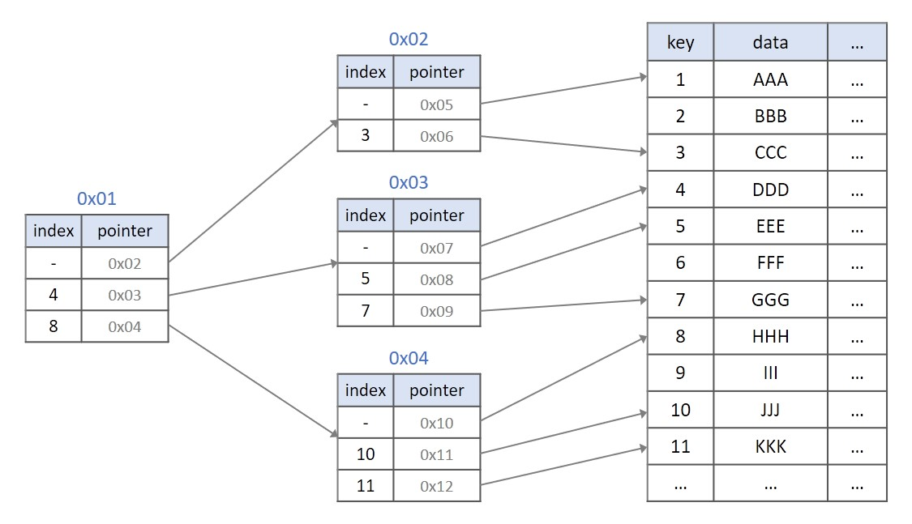

# 인덱스 기본과 B-Tree 구조

> 목표: 인덱스가 왜 필요한지 이해하고, MySQL에서 가장 많이 쓰이는 B-Tree 인덱스와 InnoDB의 클러스터링 인덱스 구조를 설명할 수 있다.

---

# 1. 디스크 읽기 방식

디스크는 컴퓨터에서 가장 느린 장치 중 하나다.

데이터베이스 성능 튜닝의 핵심은 결국 다음 질문으로 이어진다.

> 어떻게 디스크 I/O를 줄일 것인가?

인덱스도 이 질문에서 출발한다.

---

## 1.1 HDD, SSD

HDD는 내부 원판이 회전하고, 헤더가 움직이면서 데이터를 읽는다.

SSD는 원판이 없고 전기적으로 데이터를 읽는다.

그래서 SSD가 HDD보다 훨씬 빠르다.

하지만 SSD라고 해서 모든 읽기가 똑같이 빠른 것은 아니다.

SSD 제품 사양을 봐도 보통 다음 두 성능을 나눠서 표시한다.

| 구분 | 의미 |
|---|---|
| 순차 I/O | 연속된 데이터를 차례대로 읽고 쓰는 방식 |
| 랜덤 I/O | 여기저기 흩어진 데이터를 읽고 쓰는 방식 |

---

## 1.2 순차 I/O와 랜덤 I/O

순차 I/O는 데이터를 연속해서 읽는다.

```text
[1][2][3][4][5][6][7][8]
 →  →  →  →  →  →  →
```

랜덤 I/O는 필요한 데이터를 여기저기 찾아다닌다.

```text
[1][2][3][4][5][6][7][8]
 ↑        ↑     ↑
```

HDD에서는 원판 회전과 헤더 이동 때문에 랜덤 I/O가 매우 느리다.

SSD도 HDD만큼은 아니지만, 랜덤 I/O가 조금 더 느리다.

쿼리 튜닝은 보통 랜덤 I/O를 순차 I/O로 바꾸는 작업이 아니다.

더 현실적인 목표는 이것이다.

> 랜덤 I/O를 줄여 쿼리를 처리하는 데 꼭 필요한 데이터만 읽도록 만드는 것

---

# 2. 인덱스란?

인덱스는 책의 맨 뒤에 있는 찾아보기와 비슷하다.

책에서 특정 단어를 찾는다고 하자.

```text
방법 1. 책을 처음부터 끝까지 읽는다.
방법 2. 찾아보기에서 단어를 찾고 해당 페이지로 이동한다.
```

DBMS도 마찬가지다.

테이블의 모든 데이터를 처음부터 끝까지 검색하면 시간이 오래 걸린다.

그래서 DBMS는 자주 검색되는 컬럼 값을 미리 정렬해서 보관한다.

```text
인덱스 = 컬럼 값 + 해당 레코드를 찾기 위한 정보
```

예시:

```text
email 인덱스

a@test.com -> id=1
b@test.com -> id=2
c@test.com -> id=3
```

---

## 2.1 인덱스의 핵심 특징

인덱스는 정렬되어 있다.

정렬되어 있기 때문에 빠르게 찾을 수 있다.

하지만 정렬을 유지해야 하기 때문에 데이터가 추가, 삭제, 변경될 때 비용이 든다.

```text
SELECT는 빨라질 수 있음
INSERT, UPDATE, DELETE는 느려질 수 있음
```

---

## 2.2 SortedList와 ArrayList

인덱스는 `SortedList`와 비슷하게 생각할 수 있다.

### ArrayList

```text
저장 순서대로 그냥 넣는다.

[봉구스][티모][라이][서여]
```

장점:

```text
추가가 빠르다.
```

단점:

```text
원하는 값을 찾으려면 처음부터 끝까지 확인해야 할 수 있다.
```

### SortedList

```text
항상 정렬된 상태를 유지한다.

[라이][봉구스][서여][티모]
```

장점:

```text
검색이 빠르다.
```

단점:

```text
새 값을 넣을 때 정렬 위치를 찾아야 한다.
중간에 끼워 넣어야 할 수 있다.
```

DBMS 인덱스도 비슷하다.

| 작업 | 인덱스가 없을 때 | 인덱스가 있을 때 |
|---|---|---|
| SELECT | 느릴 수 있음 | 빨라질 수 있음 |
| INSERT | 상대적으로 빠름 | 인덱스도 추가해야 함 |
| UPDATE | 상대적으로 빠름 | 인덱스 컬럼 변경 시 비용 증가 |
| DELETE | 상대적으로 빠름 | 인덱스도 삭제 처리해야 함 |

---

## 2.3 인덱스의 분류

인덱스는 여러 기준으로 나눌 수 있다.

### 역할 기준

| 구분 | 설명 |
|---|---|
| 프라이머리 키 | 레코드를 식별하는 기본 키. InnoDB에서는 클러스터링 인덱스 역할 |
| 세컨더리 인덱스 | 프라이머리 키가 아닌 보조 인덱스 |

### 알고리즘 기준

| 구분 | 설명 |
|---|---|
| **B-Tree 인덱스** | 가장 일반적이고 범용적인 인덱스 |
| Hash 인덱스 | 동등 비교에 강하지만 범위 검색에는 부적합 |
| R-Tree 인덱스 | 공간 데이터 검색에 사용 |
| 전문 검색 인덱스 | 텍스트 검색에 사용 |

이번 수업의 핵심은 B-Tree 인덱스다.

---

# 3. B-Tree 인덱스

B-Tree는 MySQL에서 가장 일반적으로 사용되는 인덱스 구조다.

대부분의 일반 인덱스는 B-Tree 기반이라고 생각하면 된다.

B-Tree는 데이터를 정렬된 상태로 유지하면서 빠르게 검색할 수 있도록 만든 트리 구조다.

(B는 Binary가 아니라 Balanced이다.)

---

## 3.1 B-Tree 기본 구조

B-Tree는 다음 노드들로 구성된다.

```text
                 [루트 노드]
                    30
                  /    \
          [브랜치 노드] [브랜치 노드]
             10, 20       40, 50
           /   |   \     /   |   \
        리프  리프  리프 리프  리프  리프
```

| 노드 | 역할 |
|---|---|
| 루트 노드 | 탐색의 시작점 |
| 브랜치 노드 | 중간 경로 안내 |
| 리프 노드 | 실제 인덱스 키가 저장되는 최종 위치 |

> 루트와 브랜치는 길 안내를 하고, 리프는 실제 결과를 가진다.

B-Tree는 단계적으로 범위를 좁혀서 데이터를 찾는다.

예를 들어 `37`을 찾는다고 하자.

```text
루트 노드: 37은 30보다 크다
→ 오른쪽으로 이동

브랜치 노드: 37은 40보다 작다
→ 왼쪽으로 이동

리프 노드: 37을 찾는다
```

## 3.2 데이터베이스에서의 B-Tree



왼쪽이 루트 노드, 오른쪽이 리프노드이며, 그 사이는 모두 브랜치 노드이다. 브랜치 노드의 depth는 1 이상이 될 수도 있다.

---

# 4. 데이터베이스에서의 B-Tree 인덱스 구조

앞에서 본 B-Tree 그림은 개념적인 구조다.

데이터베이스에서 B-Tree 인덱스를 볼 때 중요한 점은 리프 노드에 무엇이 저장되는지다.

```text
루트 노드
→ 브랜치 노드
→ 리프 노드
```

리프 노드에는 인덱스 키와 함께 실제 레코드를 찾기 위한 정보가 저장된다.

```text
email 인덱스

a@test.com -> 레코드를 찾기 위한 정보
b@test.com -> 레코드를 찾기 위한 정보
c@test.com -> 레코드를 찾기 위한 정보
```

여기서 "레코드를 찾기 위한 정보"가 정확히 무엇인지는 스토리지 엔진에 따라 달라진다.

지금은 일단 이렇게 이해하면 된다.

> B-Tree 인덱스는 검색 키를 정렬해두고, 리프 노드에서 실제 레코드로 이동할 수 있는 정보를 제공한다.

이후 클러스터링 인덱스와 세컨더리 인덱스를 다룰 때, InnoDB에서는 이 정보가 왜 프라이머리 키 값이 되는지 다시 살펴본다.

---

# 5. B-Tree 인덱스 키 추가, 삭제, 변경, 검색

인덱스는 조회를 빠르게 하지만, 데이터 변경 시 인덱스도 함께 관리해야 한다.

예시 테이블:

```sql
CREATE TABLE member (
    id BIGINT PRIMARY KEY,
    email VARCHAR(100),
    name VARCHAR(20),
    INDEX idx_email(email)
);
```

---

## 5.1 인덱스 키 추가

```sql
INSERT INTO member(id, email, name)
VALUES (1, 'a@test.com', '봉구스');
```

인덱스가 없다면 row만 저장하면 된다.

하지만 `email` 인덱스가 있다면 다음 작업도 필요하다.

```text
1. 실제 member row 저장
2. idx_email B-Tree에서 'a@test.com'이 들어갈 위치 탐색
3. 리프 노드에 'a@test.com -> id=1' 저장
```

B-Tree는 정렬된 구조라서 아무 위치에 넣을 수 없다.

만약 리프 노드가 꽉 차면 페이지 분할이 발생할 수 있다.

```text
리프 노드가 꽉 참
→ 새 키를 넣을 공간 없음
→ 노드를 쪼갬
→ 상위 브랜치 노드도 수정될 수 있음
```

### 인덱스가 많으면 왜 느려질까?

대략적으로 생각하면 다음과 같다.

```text
테이블 row 저장 비용 = 1
인덱스 1개 추가 비용 = 1.5
```

인덱스가 3개라면?

```text
인덱스 3개면
1 + 1.5 * 3 = 5.5
```

정확한 수치가 아닌 대략적인 수치이다.

---

## 5.2 인덱스 키 삭제

```sql
DELETE FROM member
WHERE id = 1;
```

데이터가 삭제되면 인덱스에서도 해당 키를 삭제해야 한다.

B-Tree 인덱스에서는 해당 키가 있는 리프 노드를 찾아 삭제 마크를 한다.

```text
idx_email

a@test.com -> id=1  [삭제 표시]
b@test.com -> id=2
c@test.com -> id=3
```

삭제된 공간은 나중에 재활용될 수 있다.

### 핵심

> 인덱스 삭제는 리프 노드의 키를 찾아 삭제 표시를 하는 작업이다.

---

## 5.3 인덱스 키 변경

```sql
UPDATE member
SET email = 'new@test.com'
WHERE id = 1;
```

인덱스 키 값은 정렬 위치를 결정한다.

따라서 값이 바뀌면 기존 위치에 그대로 둘 수 없다.

```text
기존 키 삭제
+ 새 키 추가
```

예시:

```text
1. 'a@test.com -> id=1' 삭제
2. 'new@test.com -> id=1' 추가
```

### 핵심

> 인덱스 키 변경은 내부적으로 삭제 후 추가에 가깝다.

---

## 5.4 인덱스 키 검색

인덱스 검색은 B-Tree를 루트부터 리프까지 탐색하는 방식이다.

```sql
SELECT *
FROM member
WHERE email = 'a@test.com';
```

```text
루트 노드
→ 브랜치 노드
→ 리프 노드
→ a@test.com 발견
→ 실제 row 조회
```

B-Tree 인덱스는 다음 조건에서 잘 사용된다.

B-Tree 인덱스는 다음과 같은 조건에서 잘 사용된다.

| 조건 | 예시 | 사용 가능성 |
|---|---|---|
| 전체 일치 | `email = 'a@test.com'` | 높음 |
| 앞부분 일치 | `email LIKE 'a%'` | 높음 |
| 범위 검색 | `email > 'm'` | 가능 |
| 범위 검색 | `created_at BETWEEN '2026-01-01' AND '2026-01-31'` | 가능 |
| 앞부분을 알 수 없는 검색 | `email LIKE '%test.com'` | 낮음 |

B-Tree는 정렬된 구조이기 때문에 특정 값과 정확히 일치하는 검색뿐 아니라, 시작 지점을 찾을 수 있는 범위 검색에도 사용할 수 있다.

```text
a@test.com
b@test.com  ← 여기부터 읽기 시작
c@test.com
d@test.com  ← 여기까지 읽고 종료
```

반대로 `LIKE '%test.com'`처럼 앞부분을 알 수 없는 조건은 시작 지점을 정하기 어렵기 때문에 인덱스를 효율적으로 사용하기 어렵다.


---

# 6. B-Tree 인덱스 사용에 영향을 미치는 요소

인덱스가 있다고 항상 빠른 것은 아니다.

B-Tree 인덱스의 효율에는 여러 요소가 영향을 준다.

---

## 6.1 인덱스 키 값의 크기

인덱스 키가 작으면 한 페이지에 더 많은 키를 담을 수 있다.

```text
키가 작음
→ 한 페이지에 많이 저장
→ 트리 높이가 낮아질 가능성
→ 읽어야 할 페이지 수 감소
```

반대로 키가 크면 한 페이지에 적게 들어간다.

```text
키가 큼
→ 한 페이지에 적게 저장
→ 트리 높이가 커질 수 있음
→ 더 많은 페이지 읽기 발생
```

예시:

| 인덱스 컬럼 | 키 크기 |
|---|---|
| BIGINT id | 작음 |
| 긴 VARCHAR email | 상대적으로 큼 |
| UUID 문자열 | 큼 |

---

## 6.2 B-Tree의 깊이

B-Tree의 깊이는 루트 노드에서 리프 노드까지 내려가는 단계 수를 의미한다.

```text
깊이가 낮음
루트 → 리프

깊이가 높음
루트 → 브랜치 → 브랜치 → 리프
```

깊이가 깊어질수록 데이터를 찾기 위해 읽어야 하는 페이지 수가 늘어난다.

```text
B-Tree 깊이 3
→ 루트 페이지 1번 읽기
→ 브랜치 페이지 1번 읽기
→ 리프 페이지 1번 읽기
```

B-Tree의 깊이에 영향을 주는 대표적인 요소는 인덱스 키의 크기다.

```text
인덱스 키가 작음
→ 한 페이지에 많은 키 저장
→ 트리 깊이가 낮아질 가능성

인덱스 키가 큼
→ 한 페이지에 적은 키 저장
→ 트리 깊이가 깊어질 가능성
```

그래서 너무 긴 컬럼을 인덱스로 만들면 인덱스 크기가 커지고, 읽어야 하는 페이지도 많아질 수 있다.

### 핵심

> 인덱스 키가 작을수록 한 페이지에 더 많은 키를 담을 수 있고, B-Tree 깊이를 낮게 유지하는 데 유리하다.

## 6.3 선택도

선택도는 값의 종류가 얼마나 다양한지를 의미한다.

| 컬럼 | 예시 값 | 선택도 |
|---|---|---|
| gender | M, F | 낮음 |
| email | 사용자마다 다름 | 높음 |
| status | READY, DONE, CANCEL | 낮음 |
| user_id | 사용자마다 다름 | 높음 |

인덱스는 보통 선택도가 높은 컬럼에서 효과가 좋다.

예를 들어 `email`은 특정 사용자를 거의 바로 찾을 수 있다.

```sql
WHERE email = 'a@test.com'
```

하지만 `gender`는 결과가 너무 많을 수 있다.

```sql
WHERE gender = 'M'
```

전체 데이터의 절반을 읽어야 한다면 인덱스 효과가 작다.

### 핵심

> 인덱스는 결과 범위를 많이 줄여줄수록 효과가 좋다.

---

## 6.4 읽어야 하는 레코드 수

인덱스를 쓰면 보통 랜덤 I/O가 발생한다.

결과가 적으면 좋다.

```text
100만 건 중 10건 조회
→ 인덱스 유리
```

결과가 너무 많으면 오히려 풀 테이블 스캔이 나을 수 있다.

```text
100만 건 중 80만 건 조회
→ 풀 테이블 스캔이 나을 수 있음
```

### 핵심

> 인덱스는 적은 데이터를 골라낼 때 강하다.

---

# 7. B-Tree 인덱스를 통한 데이터 읽기

B-Tree 인덱스를 통해 데이터를 읽는 방식은 여러 가지가 있다.

이번 수업에서는 가장 중요한 세 가지를 중심으로 본다.

| 방식 | 설명 | 중요도 |
|---|---|---|
| 인덱스 레인지 스캔 | 범위 조건으로 인덱스를 탐색 | 매우 중요 |
| 인덱스 풀 스캔 | 인덱스 전체를 스캔 | 중요 |
| 루스 인덱스 스캔 | 일부 키만 건너뛰며 스캔 | 개념만 |

---

## 7.1 인덱스 레인지 스캔

가장 일반적인 인덱스 사용 방식이다.

```sql
SELECT *
FROM member
WHERE email >= 'b@test.com'
  AND email < 'd@test.com';
```

인덱스에서 시작 지점을 찾고, 범위에 해당하는 리프 노드를 차례로 읽는다.

```text
a@test.com
b@test.com  ← 시작
c@test.com
d@test.com  ← 종료
```

### 핵심

> 인덱스 레인지 스캔은 시작 지점을 찾은 뒤, 필요한 범위만 읽는다.

---

## 7.2 인덱스 풀 스캔

인덱스 전체를 처음부터 끝까지 읽는 방식이다.

테이블 전체를 읽는 것보다 인덱스가 더 작다면 유리할 수 있다.

```sql
SELECT email
FROM member;
```

만약 `email` 인덱스만 읽어도 된다면 테이블 전체보다 인덱스 전체를 읽는 것이 더 가벼울 수 있다.

```text
테이블 전체 row 읽기
vs
email 인덱스만 전체 읽기
```

---

## 7.3 루스 인덱스 스캔

~~루스 인덱스 스캔은 자주 사용되지 않기 때문에 설명하지 않았다. 개인 공부를 위해 개념을 정리해두었다.~~

루스 인덱스 스캔은 인덱스를 듬성듬성 읽는 방식이다.

예를 들어 그룹별 최솟값, 최댓값을 구할 때 일부 상황에서 활용될 수 있다.

```sql
SELECT team_name, MIN(user_score)
FROM employees
GROUP BY team_name;
```

개념적으로는 다음과 같다.

```text
team A의 첫 번째 값만 읽기
team B의 첫 번째 값만 읽기
team C의 첫 번째 값만 읽기
```

일반적인 인덱스 스캔은 조건에 맞는 인덱스 키를 차례대로 많이 읽는다.

루스 인덱스 스캔은 필요한 대표 값만 건너뛰며 읽는다.

```text
일반 스캔
A-1, A-2, A-3, B-1, B-2, B-3, C-1, C-2, C-3

루스 인덱스 스캔
A-1, B-1, C-1
```

주로 `GROUP BY`나 `MIN()`, `MAX()`와 함께 일부 상황에서 사용된다.

### 핵심

> 루스 인덱스 스캔은 인덱스를 전부 읽지 않고, 필요한 그룹의 일부 값만 건너뛰며 읽는 방식이다.

## 7.4 인덱스 스킵 스캔

~~인덱스 스킵 스캔은 자주 사용되지 않기 때문에 설명하지 않았다. 개인 공부를 위해 개념을 정리해두었다.~~

인덱스 스킵 스캔은 다중 칼럼 인덱스에서 선행 컬럼 조건이 없어도 인덱스를 일부 활용하는 방식이다.

예를 들어 다음 인덱스가 있다고 하자.

```sql
CREATE INDEX idx_gender_birth_date
ON member(gender, birth_date);
```

원래 다중 칼럼 인덱스는 왼쪽 컬럼부터 사용하는 것이 기본이다.

```sql
WHERE gender = 'M'
  AND birth_date >= '2000-01-01';
```

이 쿼리는 `gender`가 조건에 있으므로 인덱스를 잘 사용할 수 있다.

그런데 다음처럼 선행 컬럼인 `gender`가 빠지면 일반적으로는 인덱스를 효율적으로 사용하기 어렵다.

```sql
WHERE birth_date >= '2000-01-01';
```

인덱스 스킵 스캔은 이때 선행 컬럼의 가능한 값을 내부적으로 나눠서 탐색한다.

```text
gender = 'M'인 범위에서 birth_date 검색
+
gender = 'F'인 범위에서 birth_date 검색
```

즉, 선행 컬럼을 건너뛰는 것처럼 보이지만 실제로는 선행 컬럼의 값별로 여러 번 탐색하는 방식이다.

다만 항상 좋은 것은 아니다. 선행 컬럼의 종류가 너무 많으면 오히려 비효율적일 수 있다.

| 선행 컬럼 | 값의 종류 | 스킵 스캔 효과 |
|---|---|---|
| gender | M, F | 효과 가능 |
| status | 3~5개 정도 | 효과 가능 |
| user_id | 수십만 개 | 비효율 가능 |

### 핵심

> 인덱스 스킵 스캔은 선행 컬럼 조건이 없어도 다중 칼럼 인덱스를 일부 활용하게 해주는 방식이다.  
> 단, 선행 컬럼의 값 종류가 적을 때 유리하다.

---

# 8. 다중 칼럼 인덱스

다중 칼럼 인덱스는 여러 컬럼을 묶은 인덱스다.

```sql
CREATE INDEX idx_theme_date
ON reservation(theme_id, date);
```

중요한 것은 컬럼 순서다.

```text
idx_theme_date(theme_id, date)

먼저 theme_id로 정렬
같은 theme_id 안에서 date로 정렬
```

---

## 8.1 다중 칼럼 인덱스 예시

데이터가 다음과 같다고 하자.

```text
theme_id | date
---------|------------
1        | 2026-05-01
1        | 2026-05-02
1        | 2026-05-03
2        | 2026-05-01
2        | 2026-05-02
```

`(theme_id, date)` 인덱스는 다음 순서로 정렬된다.

```text
(1, 2026-05-01)
(1, 2026-05-02)
(1, 2026-05-03)
(2, 2026-05-01)
(2, 2026-05-02)
```

---

## 8.2 다중 칼럼 인덱스의 사용 조건

다중 칼럼 인덱스는 왼쪽 컬럼부터 순서대로 의미가 있다.

```text
idx_theme_date(theme_id, date)

1차 정렬: theme_id
2차 정렬: date
```

중요한 점은 두 번째 컬럼의 정렬은 첫 번째 컬럼이 같은 경우에만 의미가 있다는 것이다.

```text
theme_id = 1 안에서 date 정렬
(1, 2026-05-01)
(1, 2026-05-02)
(1, 2026-05-03)

theme_id = 2 안에서 date 정렬
(2, 2026-05-01)
(2, 2026-05-02)
```

즉 `date`는 전체 인덱스에서 독립적으로 정렬된 것이 아니다.

`theme_id = 1` 그룹 안에서만 date가 정렬되어 있고, `theme_id = 2` 그룹 안에서만 다시 date가 정렬되어 있다.

따라서 다음 쿼리는 인덱스를 잘 사용할 수 있다.

```sql
WHERE theme_id = 1;
```

```sql
WHERE theme_id = 1
  AND date = '2026-05-02';
```

반면 다음 쿼리는 효율이 떨어질 수 있다.

```sql
WHERE date = '2026-05-02';
```

`date`만으로는 인덱스의 시작 지점을 잡기 어렵다. 인덱스가 먼저 `theme_id` 기준으로 정렬되어 있기 때문이다.

---

## 8.3 SQL 조건 순서와 인덱스 컬럼 순서

다음 두 쿼리는 조건을 적은 순서만 다르다.

```sql
WHERE theme_id = 1
  AND date = '2026-05-02';
```

```sql
WHERE date = '2026-05-02'
  AND theme_id = 1;
```

SQL에 조건을 적은 순서는 보통 큰 문제가 아니다. 옵티마이저가 조건을 분석해 사용할 수 있는 인덱스를 선택하기 때문이다.

중요한 것은 인덱스가 어떤 순서로 만들어졌는지다.

```text
중요하지 않은 것
→ WHERE 절에 조건을 적은 순서

중요한 것
→ 인덱스 컬럼의 순서
```

### 핵심

> 다중 칼럼 인덱스는 왼쪽 컬럼부터 의미가 있다.  
> 두 번째 컬럼의 정렬은 첫 번째 컬럼 값이 같은 범위 안에서만 의미가 있다.

---

# 9. B-Tree 인덱스의 정렬 및 스캔 방향

B-Tree 인덱스는 정렬된 구조다.

따라서 정렬에도 사용할 수 있다.

```sql
CREATE INDEX idx_created_at
ON post(created_at);
```

```sql
SELECT *
FROM post
ORDER BY created_at;
```

인덱스가 이미 `created_at` 순서로 정렬되어 있다면 별도의 정렬 작업을 줄일 수 있다.

---

## 9.1 인덱스 스캔 방향

인덱스는 정방향으로도 읽고 역방향으로도 읽을 수 있다.

```sql
ORDER BY created_at ASC;
```

```sql
ORDER BY created_at DESC;
```

MySQL 8.0부터는 다음처럼 혼합 정렬 인덱스도 만들 수 있다.

```sql
CREATE INDEX idx_team_score
ON employees(team_name ASC, user_score DESC);
```

---

# 10. B-Tree 인덱스의 가용성과 효율성

인덱스가 있다고 해서 항상 검색 범위를 줄이는 데 사용할 수 있는 것은 아니다.

B-Tree 인덱스를 판단할 때는 두 가지를 구분해야 한다.

| 구분 | 의미 |
|---|---|
| 작업 범위 결정 조건 | 인덱스를 이용해 읽을 범위를 줄이는 조건 |
| 체크 조건 | 일단 읽어온 뒤 맞는지 검사하는 조건 |

인덱스 튜닝에서 중요한 것은 **작업 범위 결정 조건**이다.

```text
작업 범위 결정 조건
→ 읽어야 할 데이터 범위를 줄임

체크 조건
→ 읽은 뒤 조건에 맞는지만 검사함
```

예를 들어 인덱스로 100만 건 중 100건만 읽게 만들면 작업 범위를 줄인 것이다.

반대로 100만 건을 거의 다 읽고 조건을 검사한다면 인덱스가 있어도 효과가 작다.

---

## 10.1 인덱스를 작업 범위 결정 조건으로 사용하기 어려운 경우

다음 조건들은 B-Tree 인덱스의 특성상 작업 범위 결정 조건으로 사용하기 어렵다.

여기서 “사용하기 어렵다”는 말은 인덱스를 전혀 쓰지 못한다는 뜻이 아니다.

> 읽을 범위를 줄이는 용도로 쓰기 어렵다는 뜻이다.  
> 경우에 따라서는 체크 조건으로는 사용될 수 있다.

---

### 10.1.1 NOT-EQUAL 비교

다음과 같은 부정 조건은 B-Tree 인덱스로 범위를 좁히기 어렵다.

```sql
WHERE column <> 'N';
```

```sql
WHERE column NOT IN (10, 11, 12);
```

```sql
WHERE column NOT BETWEEN 10 AND 20;
```

```sql
WHERE column IS NOT NULL;
```

왜 어려울까?

B-Tree는 정렬된 구조라서 특정 값이나 특정 범위를 찾는 데 강하다.

```text
찾기 쉬운 조건
column = 10
column BETWEEN 10 AND 20
```

하지만 `<>`, `NOT IN` 같은 조건은 “이 값만 빼고 나머지 전부”를 의미한다.

```text
column <> 10

10보다 작은 범위
+
10보다 큰 범위
```

대부분의 데이터를 읽어야 할 수 있으므로 작업 범위를 줄이는 효과가 작다.

---

### 10.1.2 앞부분이 아닌 뒷부분 일치 LIKE

B-Tree 인덱스는 앞에서부터 정렬되어 있다.

그래서 앞부분이 고정된 패턴은 인덱스를 사용하기 좋다.

```sql
WHERE column LIKE 'abc%';
```

```text
abc로 시작하는 범위를 찾으면 됨
```

하지만 다음처럼 앞부분을 알 수 없는 패턴은 시작 지점을 잡기 어렵다.

```sql
WHERE column LIKE '%abc';
```

```sql
WHERE column LIKE '_abc';
```

```sql
WHERE column LIKE '%abc%';
```

예를 들어 인덱스가 다음처럼 정렬되어 있다고 하자.

```text
abc001
abc002
bcd001
helloabc
testabc
```

`LIKE 'abc%'`는 `abc`로 시작하는 지점을 찾으면 된다.

하지만 `LIKE '%abc'`는 문자열의 끝이 `abc`인지 확인해야 하므로 정렬된 앞부분을 활용하기 어렵다.

---

### 10.1.3 인덱스 컬럼을 변형한 경우

인덱스는 컬럼의 원래 값 기준으로 정렬되어 있다.

그런데 조건에서 컬럼을 함수나 연산자로 변형하면, 기존 인덱스 정렬을 그대로 활용하기 어렵다.

```sql
WHERE SUBSTRING(column, 1, 1) = 'X';
```

```sql
WHERE DAYOFMONTH(created_at) = 1;
```

예를 들어 `created_at` 인덱스는 날짜 전체 값으로 정렬되어 있다.

```text
2026-01-01
2026-01-02
2026-02-01
2026-02-02
```

그런데 다음 조건은 `created_at` 원본 값이 아니라 `DAYOFMONTH(created_at)` 결과로 비교한다.

```sql
WHERE DAYOFMONTH(created_at) = 1;
```

이 경우 인덱스의 정렬 순서를 활용하기 어렵다.

가능하면 컬럼을 변형하지 말고 범위 조건으로 바꿔야 한다.

```sql
WHERE created_at >= '2026-01-01'
  AND created_at < '2026-01-02';
```

또는 월 전체를 조회하려면 다음처럼 작성한다.

```sql
WHERE created_at >= '2026-01-01'
  AND created_at < '2026-02-01';
```

### 핵심

> 인덱스 컬럼은 가능한 한 가공하지 말고, 원본 컬럼을 그대로 비교하는 형태로 작성한다.

---

### 10.1.4 NOT-DETERMINISTIC 함수가 비교 조건에 사용된 경우

함수 중에는 실행할 때마다 결과가 달라질 수 있는 함수가 있다.

예를 들어 현재 시간, 랜덤 값 같은 함수가 대표적이다.

```sql
WHERE column = RAND();
```

```sql
WHERE column = NOW();
```

이런 함수는 실행 시점마다 값이 달라질 수 있기 때문에 인덱스 최적화에 불리할 수 있다.

수업에서는 다음 정도만 기억하면 충분하다.

> 비교 조건에 실행할 때마다 값이 달라질 수 있는 함수가 들어가면 인덱스 사용이 불리해질 수 있다.

---

### 10.1.5 데이터 타입이 서로 다른 비교

인덱스 컬럼의 타입과 비교 값의 타입이 다르면 형 변환이 발생할 수 있다.

특히 인덱스 컬럼 쪽을 변환해야 비교가 가능한 경우 인덱스를 효율적으로 사용하기 어렵다.

```sql
WHERE char_column = 10;
```

`char_column`이 문자열 타입인데 숫자 `10`과 비교하고 있다.

이런 식의 비교는 MySQL이 내부적으로 타입 변환을 수행할 수 있다.

안전하게 하려면 타입을 맞춰서 비교하는 것이 좋다.

```sql
WHERE char_column = '10';
```

### 핵심

> 인덱스 컬럼의 타입과 비교 값의 타입을 맞추자.

---

### 10.1.6 문자열 콜레이션이 다른 경우

문자열 비교에서는 문자 집합과 콜레이션도 중요하다.

콜레이션이 다르면 문자열 비교 방식이 달라질 수 있다.

```sql
WHERE utf8_bin_char_column = euckr_bin_char_column;
```

서로 다른 콜레이션의 컬럼을 비교하면 변환이 필요할 수 있고, 인덱스 사용이 불리해질 수 있다.

수업에서는 깊게 다루지 않아도 된다.

> 문자열 인덱스를 사용할 때는 컬럼의 문자 집합과 콜레이션이 비교 대상과 맞는지도 확인해야 한다.

---

## 10.2 NULL 값과 인덱스

일부 DBMS에서는 NULL 값이 인덱스에 저장되지 않는 경우가 있다.

하지만 MySQL에서는 NULL 값도 인덱스에 저장된다.

따라서 다음 조건도 작업 범위 결정 조건으로 인덱스를 사용할 수 있다.

```sql
WHERE column IS NULL;
```

예를 들어 인덱스에 다음 값들이 있다고 하자.

```text
NULL
NULL
A
B
C
```

`IS NULL` 조건은 NULL 값이 모여 있는 범위를 찾으면 되므로 인덱스를 사용할 수 있다.

주의할 점은 `IS NOT NULL`이다.

```sql
WHERE column IS NOT NULL;
```

이 조건은 NULL이 아닌 대부분의 값을 읽어야 할 수 있으므로, 앞에서 본 것처럼 작업 범위 결정 조건으로 효율이 떨어질 수 있다.

---

## 10.3 사용 가능성과 효율성 정리

| 조건 | 작업 범위 결정 조건으로 사용 | 이유 |
|---|---|---|
| `column = 10` | 가능 | 특정 값을 바로 찾을 수 있음 |
| `column > 10` | 가능 | 시작 범위를 정할 수 있음 |
| `column BETWEEN 10 AND 20` | 가능 | 시작과 끝 범위를 정할 수 있음 |
| `column LIKE 'abc%'` | 가능 | 앞부분 기준으로 범위를 정할 수 있음 |
| `column IS NULL` | 가능 | MySQL은 NULL도 인덱스에 저장함 |
| `column <> 10` | 어려움 | 제외한 나머지 대부분을 읽을 수 있음 |
| `column NOT IN (...)` | 어려움 | 부정 조건이라 범위 축소 효과가 작음 |
| `column IS NOT NULL` | 어려움 | NULL이 아닌 대부분을 읽을 수 있음 |
| `column LIKE '%abc'` | 어려움 | 앞부분을 알 수 없어 시작 위치를 잡기 어려움 |
| `SUBSTRING(column, 1, 1) = 'X'` | 어려움 | 인덱스 컬럼이 변형됨 |
| `DAYOFMONTH(column) = 1` | 어려움 | 인덱스 컬럼이 변형됨 |
| `char_column = 10` | 주의 | 타입 변환이 발생할 수 있음 |
| 서로 다른 콜레이션 비교 | 주의 | 문자열 비교 방식 변환이 필요할 수 있음 |

---

## 10.4 핵심 정리

B-Tree 인덱스를 잘 사용하려면 다음을 기억하자.

```text
1. 인덱스 컬럼을 그대로 비교한다.
2. 앞부분부터 비교할 수 있는 조건이 좋다.
3. 부정 조건은 범위를 줄이기 어렵다.
4. 타입을 맞춰서 비교한다.
5. MySQL에서는 IS NULL 조건도 인덱스를 사용할 수 있다.
```

마지막으로 한 문장으로 정리하면:

> B-Tree 인덱스는 정렬된 값을 기준으로 시작 지점과 종료 지점을 찾을 수 있을 때 가장 효과적이다.

---

