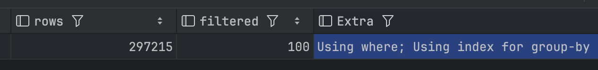
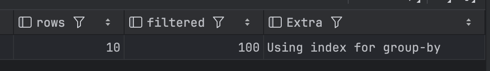
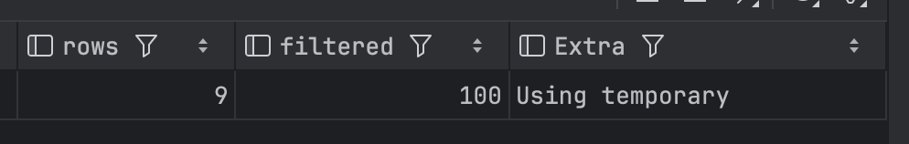
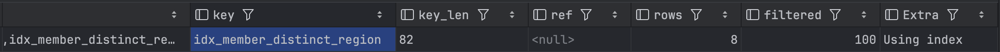
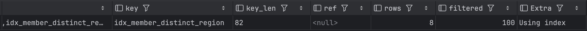
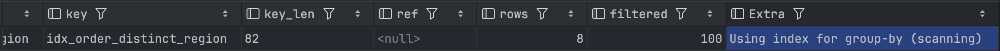

# Real MySQL 9.1 ~9.2 정리

## 저번주 복습

- **쿼리 실행 흐름**
  - SQL 파싱 -> 실행 계획 수립 -> 스토리지 엔진에서 데이터 읽기
  - 실행 계획에는 테이블 접근 순서, 인덱스 선택, 조인 방식, 정렬 방식이 담긴다.

- **옵티마이저 종류**
  - 비용 기반 최적화(CBO)는 여러 실행 방법의 비용을 계산하고 가장 저렴한 계획을 수립하는 방식이다.
  - **규칙 기반 최적화(RBO)는 옵티마이저에 내장된 우선순위 규칙에 따라 실행 계획을 수립하는 방식이다.

- **테이블 읽기 방식**
  - `type = ALL`: **풀 테이블 스캔**. 테이블 레코드를 직접 훑는다.
  - `type = index`: **풀 인덱스 스캔**. 인덱스를 처음부터 끝까지 읽는다.

- **ORDER BY**
  - 인덱스 순서와 `ORDER BY` 순서가 맞으면 별도 정렬 없이 처리할 수 있다.
  - 인덱스로 정렬을 해결하지 못하면 `Extra`에 `Using filesort`가 표시될 수 있다.
  - Filesort는 디스크 정렬만 뜻하는 것이 아니라, 별도 정렬 알고리즘을 사용했다는 의미다.

- **소트 버퍼와 정렬 알고리즘**
  - 정렬 데이터가 소트 버퍼에 들어가면 메모리에서 처리할 수 있다.
  - 소트 버퍼를 넘어서면 나누어 정렬한 뒤 병합하므로 비용이 커진다.
  - 싱글 패스 정렬은 SELECT 대상 전체를 담고, 투 패스 정렬은 정렬 키와 식별자만 담은 뒤 테이블을 다시 읽는다.

- **조인과 ORDER BY**
  - 인덱스 순서로 정렬을 해결하는 것이 가장 좋다.
  - 드라이빙 테이블만 먼저 정렬할 수 있으면 조인 결과 전체를 정렬하는 것보다 낫다.
  - 조인 결과를 임시 테이블에 담고 다시 정렬하면 `Using temporary; Using filesort`가 표시될 수 있다.

- **스트리밍 vs 버퍼링**
  - 인덱스 정렬은 앞에서부터 읽다가 `LIMIT` 개수를 채우면 멈출 수 있다.
  - Filesort, GROUP BY, DISTINCT는 중간 결과가 필요해 버퍼링 성격이 강하다.
  - 버퍼링 방식은 `LIMIT`이 있어도 선행 작업 비용이 크게 줄지 않을 수 있다.

- **정렬 상태 변수**
  - `SHOW SESSION STATUS LIKE 'Sort%';`로 정렬 발생 여부를 확인할 수 있다.
  - `Sort_rows`가 증가하면 별도 정렬에 참여한 레코드가 있었다는 뜻이다.
  - 인덱스 순서로 정렬을 해결한 경우에는 보통 `Sort_rows`가 증가하지 않는다.

- **실행 계획 볼 때 핵심**
  - `type`: 테이블을 어떤 방식으로 읽는가.
  - `key`: 어떤 인덱스를 선택했는가.
  - `Extra`: `Using filesort`, `Using temporary`, `Using index` 같은 추가 작업이 있는가.

## 8. 옵티마이저의 실행 계획을 알아야 하는 이유

실행 계획을 이해할 수 있어야만 **실행 계획의 불합리한 부분을 찾아내고**,

**더 최적화된 방법으로 실행 계획을 수립하도록 유도**할 수 있다.

## 9. GROUP BY 처리

`GROUP BY`도 인덱스를 사용할 수 있는 경우와 그렇지 못한 경우로 나눌 수 있다.

`GROUP BY`에 사용된 조건 중 `HAVING` 절은 인덱스를 사용해서 처리될 수 없다. 따라서 `HAVING` 절 자체를 튜닝하는 것은 큰 의미가 없다.

`GROUP BY` 처리 방식은 크게 다음과 같다.

- 인덱스 스캔을 이용한 `GROUP BY`
- 루스 인덱스 스캔을 이용한 `GROUP BY`
- 임시 테이블을 이용한 `GROUP BY`

### 인덱스 스캔을 이용한 GROUP BY

인덱스를 차례대로 읽으면서 그루핑 작업을 수행하고, 그 결과를 기반으로 조인을 처리한다.

그룹 함수를 사용하는 경우에는 임시 테이블이 필요할 때도 있다.

이 방식이 사용되면 실행 계획의 `Extra` 컬럼에 별도 메시지가 표시되지 않는다.

실습으로 확인해보자. `GROUP BY` 컬럼 순서가 인덱스와 맞으면 인덱스를 차례대로 읽으면서 그룹핑할 수 있다.

```sql
DROP TABLE IF EXISTS member_group_by_index_scan_lab;

CREATE TABLE member_group_by_index_scan_lab (
    id BIGINT NOT NULL AUTO_INCREMENT,
    name VARCHAR(50) NOT NULL,
    region VARCHAR(20) NOT NULL,
    age INT NOT NULL,
    joined_at DATETIME NOT NULL,
    PRIMARY KEY (id),
    INDEX idx_member_group_by_region_age (region, age)
);

INSERT INTO member_group_by_index_scan_lab (name, region, age, joined_at)
VALUES
    ('kim', 'SEOUL', 20, '2026-01-01 09:00:00'),
    ('lee', 'SEOUL', 20, '2026-01-02 09:00:00'),
    ('park', 'SEOUL', 21, '2026-01-03 09:00:00'),
    ('choi', 'BUSAN', 30, '2026-01-04 09:00:00'),
    ('jung', 'BUSAN', 30, '2026-01-05 09:00:00'),
    ('kang', 'BUSAN', 31, '2026-01-06 09:00:00'),
    ('yoon', 'DAEGU', 25, '2026-01-07 09:00:00'),
    ('jang', 'DAEGU', 26, '2026-01-08 09:00:00');

EXPLAIN
SELECT region, age, COUNT(*)
FROM member_group_by_index_scan_lab
GROUP BY region, age;

DROP TABLE member_group_by_index_scan_lab;
```

확인할 것:


- `key`가 `idx_member_group_by_region_age`인지 확인한다.
- `Extra`에 `Using temporary`가 없다면 임시 테이블 없이 그룹핑한 것이다.

### 루스 인덱스 스캔을 이용한 GROUP BY

루스 인덱스 스캔은 인덱스의 레코드를 모두 읽지 않고, 필요한 부분만 건너뛰며 읽는 방식이다.

일반적인 인덱스 스캔은 조건에 맞는 인덱스 범위를 처음부터 끝까지 차례대로 읽는다. 이런 방식은 촘촘하게 읽는다는 의미로 **타이트 인덱스 스캔(Tight Index Scan)** 이라고 볼 수 있다.

반면 루스 인덱스 스캔은 그룹별로 필요한 첫 번째 값이나 마지막 값만 읽고, 다음 그룹으로 건너뛴다. 그래서 전체 인덱스를 다 읽지 않아도 된다.

예를 들어 다음과 같은 테이블과 인덱스가 있다고 하자.

```sql
DROP TABLE IF EXISTS salaries
CREATE TABLE salaries (
    emp_no INT NOT NULL,
    from_date DATE NOT NULL,
    salary INT NOT NULL,
    PRIMARY KEY (emp_no, from_date)
);
```

`PRIMARY KEY (emp_no, from_date)` 인덱스는 다음 순서로 정렬되어 있다.

```text
emp_no -> from_date
```

이 상태에서 다음 쿼리를 실행한다고 해보자.

```sql
EXPLAIN
SELECT emp_no
FROM salaries
WHERE from_date = '1985-03-01'
GROUP BY emp_no;
```

실행 계획의 `Extra`에 다음과 비슷한 메시지가 표시될 수 있다.


```text
Using where; Using index for group-by
```

여기서 `Using index for group-by`가 루스 인덱스 스캔을 의미한다.

이 쿼리는 `emp_no`별로 그룹을 만들면 된다. 인덱스가 이미 `emp_no` 순서로 정렬되어 있으므로 MySQL은 같은 `emp_no` 값을 가진 인덱스 레코드를 전부 읽지 않고, 각 `emp_no` 그룹의 필요한 위치만 확인한 뒤 다음 `emp_no` 그룹으로 넘어갈 수 있다.

개념적으로는 다음과 비슷하다.

```text
emp_no = 10001 그룹에서 조건에 맞는 from_date 확인
-> emp_no = 10002 그룹으로 점프
-> emp_no = 10003 그룹으로 점프
-> ...
```

즉, 인덱스를 한 줄씩 끝까지 훑는 것이 아니라 그룹 단위로 건너뛰며 읽는다.

루스 인덱스 스캔이 특히 유리한 대표적인 경우는 그룹별 최솟값이나 최댓값을 구할 때다.

```sql
EXPLAIN
SELECT emp_no, MIN(from_date)
FROM salaries
GROUP BY emp_no;
```

`PRIMARY KEY (emp_no, from_date)` 인덱스에서는 같은 `emp_no` 안에서 `from_date`가 정렬되어 있다. 따라서 각 `emp_no` 그룹의 첫 번째 `from_date`만 읽으면 `MIN(from_date)`를 구할 수 있다.

반대로 최댓값은 각 그룹의 마지막 값만 읽으면 된다.

```sql
EXPLAIN
SELECT emp_no, MAX(from_date)
FROM salaries
GROUP BY emp_no;
```

다만 루스 인덱스 스캔은 아무 `GROUP BY`에서나 사용할 수 있는 것은 아니다. 인덱스의 왼쪽부터 이어지는 컬럼 순서와 `GROUP BY` 컬럼 순서가 맞아야 하고, 집계 함수도 주로 `MIN()` 또는 `MAX()`처럼 인덱스의 첫 값이나 마지막 값만 읽어도 되는 형태일 때 효과적이다.

예를 들어 다음 쿼리는 인덱스가 `(emp_no, from_date)`일때, `GROUP BY`가 인덱스의 왼쪽부터 이어지는 형태가 아니므로 루스 인덱스 스캔을 사용하기 어렵다.

```sql
EXPLAIN
SELECT from_date
FROM salaries
GROUP BY from_date;
```

또한 `SUM()`, `AVG()`, `COUNT()`처럼 그룹 안의 모든 값을 확인해야 하는 집계는 그룹의 첫 값이나 마지막 값만 읽어서 계산할 수 없다. 이런 경우에는 루스 인덱스 스캔보다 일반 인덱스 스캔이나 임시 테이블을 사용하는 방식으로 처리될 가능성이 높다.

```sql
EXPLAIN
SELECT emp_no, AVG(salary)
FROM salaries
GROUP BY emp_no;
```

정리하면, 루스 인덱스 스캔은 `GROUP BY`를 위해 인덱스를 전부 읽는 것이 아니라 **그룹별 대표 지점만 읽고 다음 그룹으로 건너뛰는 최적화**다. 그래서 그룹 수에 비해 전체 레코드 수가 많을수록 효과가 커진다.

이 방식이 사용되면 실행 계획의 `Extra` 컬럼에 다음 메시지가 표시된다.

```text
Using index for group-by
```

실습으로도 확인해보자.

```sql
SET SESSION cte_max_recursion_depth = 50000;

DROP TABLE IF EXISTS reservation_loose_index_scan_lab;

CREATE TABLE reservation_loose_index_scan_lab (
                                                id BIGINT NOT NULL AUTO_INCREMENT,
                                                member_id BIGINT NOT NULL,
                                                reservation_time DATETIME NOT NULL,
                                                status VARCHAR(20) NOT NULL,
                                                PRIMARY KEY (id),
                                                INDEX idx_reservation_member_time (member_id, reservation_time)
);

INSERT INTO reservation_loose_index_scan_lab (member_id, reservation_time, status)
WITH RECURSIVE seq AS (
  SELECT 1 AS n
  UNION ALL
  SELECT n + 1
  FROM seq
  WHERE n < 50000
)
SELECT
  ((n - 1) % 10) + 1 AS member_id,
  TIMESTAMPADD(MINUTE, n, '2026-01-01 00:00:00') AS reservation_time,
  'CONFIRMED' AS status
FROM seq;

EXPLAIN
SELECT member_id, MIN(reservation_time)
FROM reservation_loose_index_scan_lab
GROUP BY member_id;

ANALYZE TABLE reservation_loose_index_scan_lab; -- 통계 갱신

-- 이거 실행하려고 하는거에요
EXPLAIN
SELECT member_id, MAX(reservation_time)
FROM reservation_loose_index_scan_lab
GROUP BY member_id;
```

확인할 것:


- `idx_reservation_member_time (member_id, reservation_time)` 인덱스를 사용할 수 있다.
- `Extra`에 `Using index for group-by`가 표시될 수 있다.

### 임시 테이블을 이용한 GROUP BY

인덱스를 전혀 사용하지 못하는 경우 임시 테이블을 이용해서 그루핑한다.

그룹 기준 컬럼이 드라이빙 테이블에 있든 드리븐 테이블에 있든 관계없이, 인덱스를 사용하지 못하면 이 방식으로 처리될 수 있다.

이 방식이 사용되면 실행 계획의 `Extra` 컬럼에 다음 메시지가 표시된다.

```text
Using temporary
```

실습으로 확인해보자. 인덱스 순서와 맞지 않는 컬럼으로 그룹핑하면 임시 테이블이 필요할 수 있다.

```sql
DROP TABLE IF EXISTS reservation_temporary_group_by_lab;

CREATE TABLE reservation_temporary_group_by_lab (
    id BIGINT NOT NULL AUTO_INCREMENT,
    member_id BIGINT NOT NULL,
    reservation_time DATETIME NOT NULL,
    status VARCHAR(20) NOT NULL,
    theme_id BIGINT NOT NULL,
    PRIMARY KEY (id),
    INDEX idx_reservation_member_time (member_id, reservation_time)
);

INSERT INTO reservation_temporary_group_by_lab (
    member_id,
    reservation_time,
    status,
    theme_id
)
VALUES
    (1, '2026-01-01 10:00:00', 'CONFIRMED', 101),
    (1, '2026-01-03 10:00:00', 'CONFIRMED', 102),
    (1, '2026-01-05 10:00:00', 'CANCELED', 101),
    (2, '2026-01-02 11:00:00', 'CONFIRMED', 101),
    (2, '2026-01-04 11:00:00', 'CONFIRMED', 103),
    (2, '2026-01-06 11:00:00', 'CANCELED', 103),
    (3, '2026-01-01 12:00:00', 'CONFIRMED', 101),
    (3, '2026-01-07 12:00:00', 'CANCELED', 102),
    (3, '2026-01-09 12:00:00', 'CONFIRMED', 103);

EXPLAIN
SELECT status, theme_id, COUNT(*)
FROM reservation_temporary_group_by_lab
GROUP BY status, theme_id;

DROP TABLE reservation_temporary_group_by_lab;
```

확인할 것:

- `GROUP BY status, theme_id`와 같은 순서의 인덱스가 없다.
- `Extra`에 `Using temporary`가 표시될 수 있다.

  

MySQL 8.0부터는 `GROUP BY` 컬럼 기준으로 묵시적 정렬을 수행하지 않는다. 정렬이 필요하다면 `ORDER BY`를 명시해야 한다.

> **왜 제거되었을까?**
>
> https://dev.mysql.com/blog-archive/removal-of-implicit-and-explicit-sorting-for-group-by/?utm_source=chatgpt.com
>
> Mysql 5.7에서는 GROUP BY에서 정렬이 필요없는 경우, ORDER BY NULL 사용을 권장했다. 그럼 성능 향상을 볼 수 있다.

## 10. DISTINCT 처리

특정 컬럼의 유니크한 값만 조회하려면 `SELECT` 쿼리에 `DISTINCT`를 사용한다.

`DISTINCT`는 집합 함수와 함께 사용되는 경우와 그렇지 않은 경우를 구분해서 이해해야 한다.

각 경우에 `DISTINCT` 키워드가 영향을 미치는 범위가 달라지기 때문이다.

그리고 `DISTINCT` 처리가 인덱스를 사용하지 못할 때는 항상 임시 테이블이 필요하다.

하지만 Extra 칼럼에는 "Using temporary" 메시지가 출력되지 않는다.

### 단순 DISTINCT

단순히 유니크한 레코드만 가져오는 `SELECT DISTINCT`는 `GROUP BY`와 유사한 방식으로 처리된다.

실습용 테이블을 만들어서 확인해보자.

```sql
DROP TABLE IF EXISTS member_distinct_lab;

CREATE TABLE member_distinct_lab (
    id BIGINT NOT NULL AUTO_INCREMENT,
    name VARCHAR(50) NOT NULL,
    region VARCHAR(20) NOT NULL,
    age INT NOT NULL,
    PRIMARY KEY (id),
    INDEX idx_member_distinct_region (region),
    INDEX idx_member_distinct_region_age (region, age)
);

INSERT INTO member_distinct_lab (name, region, age)
VALUES
    ('kim', 'SEOUL', 20),
    ('kim', 'SEOUL', 21),
    ('lee', 'SEOUL', 20),
    ('park', 'BUSAN', 30),
    ('park', 'BUSAN', 30),
    ('choi', 'DAEGU', 25),
    ('choi', 'DAEGU', 26),
    ('jung', 'INCHEON', 31);
```

먼저 `DISTINCT`와 `GROUP BY`의 실행 계획을 비교한다.

```sql
EXPLAIN
SELECT DISTINCT region
FROM member_distinct_lab;
```



```sql
EXPLAIN
SELECT region
FROM member_distinct_lab
GROUP BY region;
```



확인할 것:

- 두 쿼리 모두 `region`의 유니크한 값만 반환한다.
- `idx_member_distinct_region` 인덱스를 사용할 수 있다.
- 실행 계획이 비슷하게 나올 수 있다.

주의할 점은 `DISTINCT`가 특정 컬럼 하나에만 적용되는 것이 아니라, SELECT 절에 명시된 전체 컬럼 조합에 적용된다는 것이다.

```sql
SELECT DISTINCT name
FROM member_distinct_lab
ORDER BY name;
```

위 쿼리는 `name` 값만 기준으로 중복을 제거한다. 예를 들어 `kim`은 한 번만 나온다.

반면 다음 쿼리는 `name`만 유니크하게 가져오는 것이 아니라, `(name, age)` 조합이 유니크한 레코드를 가져온다.

```sql
SELECT DISTINCT name, age
FROM member_distinct_lab
ORDER BY name, age;
```

이 경우 `('kim', 20)`과 `('kim', 21)`은 서로 다른 조합이므로 둘 다 결과에 포함된다.

다음처럼 작성해도 결과는 동일하다. MySQL은 `DISTINCT(name)`의 괄호를 특별하게 해석하지 않는다.

```sql
SELECT DISTINCT(name), age
FROM member_distinct_lab
ORDER BY name, age;
```

실제로 다음 쿼리는 `region`만 유니크하게 만드는 것이 아니라 `(region, age)` 조합이 유니크한 결과를 반환한다.

```sql
SELECT DISTINCT region, age
FROM member_distinct_lab
ORDER BY region, age
LIMIT 20;

DROP TABLE member_distinct_lab;
```

### 집합 함수와 함께 사용된 DISTINCT

`COUNT()`, `MIN()`, `MAX()` 같은 집합 함수 안에서도 `DISTINCT`를 사용할 수 있다.

이때의 `DISTINCT`는 집합 함수의 인자로 전달된 컬럼값 중 유니크한 값만 대상으로 집계한다.

실습용 테이블을 만들어서 확인해보자.

```sql
DROP TABLE IF EXISTS order_distinct_lab;

CREATE TABLE order_distinct_lab (
    id BIGINT NOT NULL AUTO_INCREMENT,
    member_id BIGINT NOT NULL,
    region VARCHAR(20) NOT NULL,
    status VARCHAR(20) NOT NULL,
    payment_method VARCHAR(20) NOT NULL,
    PRIMARY KEY (id),
    INDEX idx_order_distinct_region (region),
    INDEX idx_order_distinct_status (status)
);

INSERT INTO order_distinct_lab (
    member_id,
    region,
    status,
    payment_method
)
VALUES
    (1, 'SEOUL', 'PAID', 'CARD'),
    (2, 'SEOUL', 'PAID', 'CARD'),
    (3, 'SEOUL', 'CANCELED', 'CASH'),
    (4, 'BUSAN', 'PAID', 'CARD'),
    (5, 'BUSAN', 'READY', 'POINT'),
    (6, 'DAEGU', 'PAID', 'CASH'),
    (7, 'DAEGU', 'READY', 'CARD'),
    (8, 'INCHEON', 'CANCELED', 'POINT');
```

`COUNT(DISTINCT region)`은 중복된 `region` 값을 제거한 뒤 개수를 센다.

```sql
EXPLAIN
SELECT COUNT(DISTINCT region)
FROM order_distinct_lab;
```



실제 결과도 확인해보자.

```sql
SELECT COUNT(DISTINCT region) AS region_count
FROM order_distinct_lab;
```

서로 다른 컬럼에 대해 각각 `COUNT(DISTINCT ...)`를 수행하면, 각 컬럼마다 별도의 중복 제거 작업이 필요할 수 있다.

```sql
EXPLAIN
SELECT
    COUNT(DISTINCT region) AS region_count,
    COUNT(DISTINCT status) AS status_count
FROM order_distinct_lab;
```

```sql
SELECT
    COUNT(DISTINCT region) AS region_count,
    COUNT(DISTINCT status) AS status_count
FROM order_distinct_lab;

DROP TABLE order_distinct_lab;
```

- `COUNT(DISTINCT ...)`는 중복 제거를 위한 내부 처리가 필요하다.
- 실행 계획에서 내부 중복 제거 작업이 항상 `Using temporary`로 표시되는 것은 아니다.
- 서로 다른 `DISTINCT` 대상이 여러 개면 각각 별도의 중복 제거 작업이 필요할 수 있다.

---

## 11. 직접 해보는 퀴즈

아래 퀴즈는 다음 실습용 테이블을 사용한다. 먼저 답을 예상한 뒤 `EXPLAIN` 또는 `EXPLAIN ANALYZE`로 실제 실행 계획을 확인해보자.

```sql
DROP TABLE IF EXISTS quiz_reservation;
DROP TABLE IF EXISTS quiz_member;

CREATE TABLE quiz_member (
    id BIGINT NOT NULL AUTO_INCREMENT,
    name VARCHAR(50) NOT NULL,
    region VARCHAR(20) NOT NULL,
    age INT NOT NULL,
    joined_at DATETIME NOT NULL,
    bio VARCHAR(200) NOT NULL,
    PRIMARY KEY (id),
    INDEX idx_quiz_member_age_joined_at (age, joined_at),
    INDEX idx_quiz_member_region_age (region, age)
);

CREATE TABLE quiz_reservation (
    id BIGINT NOT NULL AUTO_INCREMENT,
    member_id BIGINT NOT NULL,
    reservation_time DATETIME NOT NULL,
    status VARCHAR(20) NOT NULL,
    theme_id BIGINT NOT NULL,
    PRIMARY KEY (id),
    INDEX idx_quiz_reservation_member_time (member_id, reservation_time)
);

INSERT INTO quiz_member (name, region, age, joined_at, bio)
VALUES
    ('kim', 'SEOUL', 20, '2026-01-01 09:00:00', 'bio 100 alpha'),
    ('lee', 'SEOUL', 21, '2026-01-02 09:00:00', 'bio 200 beta'),
    ('park', 'SEOUL', 20, '2026-01-03 09:00:00', 'bio 300 gamma'),
    ('choi', 'SEOUL', 22, '2026-01-04 09:00:00', 'bio 400 delta'),
    ('jung', 'BUSAN', 30, '2026-01-05 09:00:00', 'bio 500 epsilon'),
    ('kang', 'BUSAN', 31, '2026-01-06 09:00:00', 'bio 600 zeta'),
    ('yoon', 'BUSAN', 30, '2026-01-07 09:00:00', 'bio 700 eta'),
    ('jang', 'DAEGU', 25, '2026-01-08 09:00:00', 'bio 800 theta'),
    ('lim', 'DAEGU', 26, '2026-01-09 09:00:00', 'bio 900 iota'),
    ('han', 'INCHEON', 27, '2026-01-10 09:00:00', 'bio 100 kappa'),
    ('oh', 'INCHEON', 28, '2026-01-11 09:00:00', 'bio 110 lambda'),
    ('shin', 'GWANGJU', 29, '2026-01-12 09:00:00', 'bio 120 mu');

INSERT INTO quiz_reservation (member_id, reservation_time, status, theme_id)
VALUES
    (1, '2026-02-01 10:00:00', 'CONFIRMED', 101),
    (1, '2026-02-03 10:00:00', 'CONFIRMED', 102),
    (2, '2026-02-02 11:00:00', 'CONFIRMED', 101),
    (2, '2026-02-04 11:00:00', 'CANCELED', 103),
    (3, '2026-02-01 12:00:00', 'CONFIRMED', 101),
    (3, '2026-02-05 12:00:00', 'READY', 102),
    (4, '2026-02-06 13:00:00', 'CONFIRMED', 103),
    (5, '2026-02-01 14:00:00', 'CANCELED', 101),
    (5, '2026-02-07 14:00:00', 'CONFIRMED', 102),
    (6, '2026-02-08 15:00:00', 'READY', 103),
    (7, '2026-02-09 16:00:00', 'CONFIRMED', 101),
    (8, '2026-02-10 17:00:00', 'CANCELED', 102),
    (9, '2026-02-11 18:00:00', 'CONFIRMED', 103),
    (10, '2026-02-12 19:00:00', 'READY', 101),
    (11, '2026-02-13 20:00:00', 'CONFIRMED', 102),
    (12, '2026-02-14 21:00:00', 'CANCELED', 103);
```

### 퀴즈 1. 풀 테이블 스캔과 풀 인덱스 스캔 구분하기

다음 두 쿼리의 실행 계획을 비교해보자.

```sql
EXPLAIN
SELECT *
FROM quiz_member
WHERE bio LIKE '%100%';

EXPLAIN
SELECT COUNT(*)
FROM quiz_member;
```

질문:

1. 각 쿼리의 `type`은 무엇인가?
2. 두 쿼리 모두 테이블 전체를 훑는 것처럼 보이는데, 왜 하나는 풀 테이블 스캔이고 다른 하나는 풀 인덱스 스캔일 수 있을까?
3. `SELECT COUNT(*)`가 `SELECT *`보다 더 작은 데이터를 읽을 수 있는 이유는 무엇일까?

확인 포인트:

- `bio LIKE '%100%'`는 앞쪽 와일드카드 때문에 일반 B-Tree 인덱스를 사용하기 어렵다.
- `COUNT(*)`는 실제 레코드 전체 컬럼을 읽지 않아도 되므로, 더 작은 인덱스를 읽는 계획이 선택될 수 있다.

<details>
<summary>퀴즈 1 정답 및 해설</summary>

#### 퀴즈 1 해설

첫 번째 쿼리는 풀 테이블 스캔이 발생할 가능성이 높다.

```sql
SELECT *
FROM quiz_member
WHERE bio LIKE '%100%';
```

`bio LIKE '%100%'`는 검색어 앞에 `%`가 붙어 있어서 B-Tree 인덱스를 이용해 시작 지점을 찾기 어렵다. 그래서 `type`이 `ALL`로 표시될 수 있다. `Extra`에는 읽어온 레코드를 `WHERE` 조건으로 다시 필터링했다는 의미로 `Using where`가 표시될 수 있다.

두 번째 쿼리는 풀 인덱스 스캔이 발생할 가능성이 높다.

```sql
SELECT COUNT(*)
FROM quiz_member;
```

전체 건수를 세는 쿼리는 모든 컬럼 값을 읽을 필요가 없다. MySQL은 테이블 전체 레코드보다 크기가 작은 인덱스를 처음부터 끝까지 읽어서 건수를 셀 수 있다. 이 경우 `type`이 `index`로 표시될 수 있다.

정리:

- `type = ALL`: 풀 테이블 스캔
- `type = index`: 풀 인덱스 스캔
- `Using where`: 읽은 레코드에 대해 `WHERE` 조건을 적용했다는 뜻

</details>

### 퀴즈 2. 인덱스를 이용한 정렬 찾기

다음 세 쿼리 중 `Using filesort`가 발생하지 않을 가능성이 가장 높은 쿼리를 골라보자.

```sql
EXPLAIN
SELECT id, age, joined_at
FROM quiz_member
ORDER BY age, joined_at
LIMIT 10;

EXPLAIN
SELECT id, age, joined_at
FROM quiz_member
ORDER BY joined_at, age
LIMIT 10;

EXPLAIN
SELECT id, age, joined_at
FROM quiz_member
ORDER BY name
LIMIT 10;
```

질문:

1. 어떤 쿼리가 `idx_quiz_member_age_joined_at` 인덱스 순서를 그대로 사용할 수 있는가?
2. `(age, joined_at)` 인덱스가 있는데도 `ORDER BY joined_at, age`는 왜 불리할까?
3. `LIMIT 10`이 있어도 Filesort가 필요하면 왜 비용이 커질 수 있을까?

확인 포인트:

- 복합 인덱스는 왼쪽 컬럼부터 정렬되어 있다.
- 인덱스 순서와 `ORDER BY` 순서가 맞으면 이미 정렬된 인덱스를 앞에서부터 읽을 수 있다.
- Filesort는 결과 10건만 반환하더라도, 어떤 10건이 앞에 올지 판단하기 위해 더 많은 레코드를 정렬해야 할 수 있다.

<details>
<summary>퀴즈 2 정답 및 해설</summary>

#### 퀴즈 2 해설

`Using filesort`가 발생하지 않을 가능성이 가장 높은 쿼리는 첫 번째 쿼리다.

```sql
SELECT id, age, joined_at
FROM quiz_member
ORDER BY age, joined_at
LIMIT 10;
```

`quiz_member` 테이블에는 다음 인덱스가 있다.

```sql
INDEX idx_quiz_member_age_joined_at (age, joined_at)
```

인덱스가 `(age, joined_at)` 순서로 정렬되어 있으므로 `ORDER BY age, joined_at`은 인덱스 순서를 그대로 사용할 수 있다.

반면 다음 쿼리는 인덱스 컬럼 순서와 `ORDER BY` 순서가 다르다.

```sql
ORDER BY joined_at, age
```

`(age, joined_at)` 인덱스는 먼저 `age`로 정렬되고, 같은 `age` 안에서 `joined_at`으로 정렬된다. 따라서 전체 결과를 `joined_at` 먼저 정렬하는 데 그대로 사용할 수 없다.

`ORDER BY name`도 `name`에 맞는 인덱스가 없으므로 Filesort가 발생할 가능성이 높다.

</details>

### 퀴즈 3. 정렬 상태 변수로 Filesort 확인하기

다음 순서대로 실행해보자.

```sql
SHOW SESSION STATUS LIKE 'Sort%';

SELECT id, age, joined_at
FROM quiz_member
ORDER BY name
LIMIT 10;

SHOW SESSION STATUS LIKE 'Sort%';
```

이어서 인덱스를 사용할 수 있는 정렬도 실행해보자.

```sql
SHOW SESSION STATUS LIKE 'Sort%';

SELECT id, age, joined_at
FROM quiz_member
ORDER BY age, joined_at
LIMIT 10;

SHOW SESSION STATUS LIKE 'Sort%';
```

질문:

1. `ORDER BY name` 실행 후 `Sort_rows` 값은 증가했는가?
2. `ORDER BY age, joined_at` 실행 후에도 같은 방식으로 증가하는가?
3. 두 결과가 다르다면, 그 이유를 실행 계획의 `Extra`와 연결해서 설명해보자.

확인 포인트:

- `Sort_rows`는 실제 정렬된 레코드 수를 보여준다.
- 인덱스를 이용한 정렬은 별도 Filesort가 필요 없으므로 정렬 관련 상태 변수 증가가 없거나 훨씬 적을 수 있다.

<details>
<summary>퀴즈 3 정답 및 해설</summary>

#### 퀴즈 3 해설

`ORDER BY name` 쿼리는 Filesort가 발생할 가능성이 높으므로 `Sort_rows`가 증가할 수 있다.

```sql
SELECT id, age, joined_at
FROM quiz_member
ORDER BY name
LIMIT 10;
```

`name` 컬럼에는 정렬에 사용할 수 있는 인덱스가 없기 때문이다. 실행 계획의 `Extra`에 `Using filesort`가 표시될 가능성이 높다.

반면 다음 쿼리는 `(age, joined_at)` 인덱스를 사용할 수 있다.

```sql
SELECT id, age, joined_at
FROM quiz_member
ORDER BY age, joined_at
LIMIT 10;
```

따라서 별도의 Filesort 없이 인덱스 순서대로 읽을 수 있고, 정렬 관련 상태 변수 증가가 없거나 훨씬 적을 수 있다.

정리:

- `ORDER BY name`: Filesort 가능성 높음, `Sort_rows` 증가 가능
- `ORDER BY age, joined_at`: 인덱스 정렬 가능성 높음, Filesort 관련 상태 변수 증가가 적음

</details>

### 퀴즈 4. 조인에서 정렬 대상 줄이기

다음 두 쿼리의 실행 계획을 비교해보자.

```sql
EXPLAIN
SELECT m.id, m.name, r.id AS reservation_id
FROM quiz_member m
STRAIGHT_JOIN quiz_reservation r ON r.member_id = m.id
ORDER BY m.name
LIMIT 10;

EXPLAIN
SELECT m.id, m.name, r.id AS reservation_id, r.reservation_time
FROM quiz_member m
STRAIGHT_JOIN quiz_reservation r ON r.member_id = m.id
ORDER BY r.reservation_time
LIMIT 10;
```

질문:

1. 두 쿼리의 `ORDER BY` 기준 컬럼은 각각 어느 테이블에 있는가?
2. 첫 번째 쿼리는 왜 드라이빙 테이블만 정렬한 뒤 조인을 수행할 수 있을까?
3. 두 번째 쿼리는 왜 `Using temporary; Using filesort`가 발생할 가능성이 높을까?

확인 포인트:

- `STRAIGHT_JOIN`을 사용하면 `quiz_member`를 먼저 읽도록 고정할 수 있다.
- 드라이빙 테이블 컬럼으로 정렬하면 조인 전에 정렬 대상을 줄일 수 있다.
- 드리븐 테이블 컬럼으로 정렬하면 조인 결과를 만든 뒤 정렬해야 하므로 임시 테이블이 필요할 수 있다.

<details>
<summary>퀴즈 4 정답 및 해설</summary>

#### 퀴즈 4 해설

첫 번째 쿼리는 정렬 기준이 드라이빙 테이블인 `quiz_member`에 있다.

```sql
ORDER BY m.name
```

`STRAIGHT_JOIN`을 사용했으므로 MySQL은 `quiz_member`를 먼저 읽는다. 따라서 `quiz_member` 레코드만 먼저 `m.name` 기준으로 정렬한 뒤, 정렬된 순서대로 `quiz_reservation`을 조인할 수 있다.

이 경우 `Extra`에는 `Using filesort`가 표시될 수 있지만, `Using temporary`는 없을 수 있다. 조인 결과 전체를 임시 테이블에 담아 정렬하는 방식은 아니기 때문이다.

두 번째 쿼리는 정렬 기준이 드리븐 테이블인 `quiz_reservation`에 있다.

```sql
ORDER BY r.reservation_time
```

`quiz_member`를 먼저 읽는 상황에서 `quiz_reservation`의 값으로 최종 정렬해야 하므로, `quiz_member`만 먼저 정렬해서는 전체 결과 순서를 보장할 수 없다. 그래서 조인 결과를 만든 뒤 임시 테이블에 담고 정렬해야 할 가능성이 높다.

정리:

- `ORDER BY m.name`: 드라이빙 테이블만 정렬 가능
- `ORDER BY r.reservation_time`: 조인 결과를 임시 테이블에 저장한 뒤 정렬할 가능성 높음

</details>

### 퀴즈 5. GROUP BY 처리 방식 맞히기

다음 세 쿼리의 `Extra`를 예상한 뒤 확인해보자.

```sql
EXPLAIN
SELECT region, age, COUNT(*)
FROM quiz_member
GROUP BY region, age;

EXPLAIN
SELECT member_id, MIN(reservation_time)
FROM quiz_reservation
GROUP BY member_id;

EXPLAIN
SELECT status, theme_id, COUNT(*)
FROM quiz_reservation
GROUP BY status, theme_id;
```

질문:

1. 어떤 쿼리가 인덱스 스캔을 이용한 `GROUP BY`로 처리될 가능성이 높은가?
2. 어떤 쿼리가 루스 인덱스 스캔 후보가 될 수 있는가?
3. 어떤 쿼리에서 `Using temporary`가 표시될 가능성이 높은가?

확인 포인트:

- `quiz_member`에는 `(region, age)` 인덱스가 있다.
- `quiz_reservation`에는 `(member_id, reservation_time)` 인덱스가 있다.
- 루스 인덱스 스캔이 선택되면 `Extra`에 `Using index for group-by`가 표시될 수 있다.
- 데이터가 적거나 옵티마이저가 일반 인덱스 스캔이 더 낫다고 판단하면 `Using index`만 표시될 수도 있다.
- `status, theme_id` 순서의 인덱스는 없으므로 임시 테이블을 사용할 가능성이 높다.

<details>
<summary>퀴즈 5 정답 및 해설</summary>

#### 퀴즈 5 해설

첫 번째 쿼리는 인덱스 스캔을 이용한 `GROUP BY`로 처리될 가능성이 높다.

```sql
SELECT region, age, COUNT(*)
FROM quiz_member
GROUP BY region, age;
```

`quiz_member` 테이블에는 `(region, age)` 인덱스가 있으므로, 인덱스 순서대로 읽으면서 그룹핑할 수 있다. `Extra`에 `Using temporary`가 없다면 임시 테이블 없이 처리된 것이다.

두 번째 쿼리는 루스 인덱스 스캔 후보가 될 수 있다.

```sql
SELECT member_id, MIN(reservation_time)
FROM quiz_reservation
GROUP BY member_id;
```

`quiz_reservation` 테이블에는 `(member_id, reservation_time)` 인덱스가 있다. 같은 `member_id` 안에서 `reservation_time`이 정렬되어 있으므로, 각 회원별 첫 번째 `reservation_time`만 확인하면 `MIN(reservation_time)`을 구할 수 있다.

이때 루스 인덱스 스캔이 선택되면 `Extra`에 `Using index for group-by`가 표시될 수 있다. 다만 실습 데이터가 작거나 옵티마이저가 일반 인덱스 스캔이 더 낫다고 판단하면 `Using index`만 표시될 수도 있다.

세 번째 쿼리는 임시 테이블을 사용할 가능성이 높다.

```sql
SELECT status, theme_id, COUNT(*)
FROM quiz_reservation
GROUP BY status, theme_id;
```

`quiz_reservation` 테이블에는 `(status, theme_id)` 순서의 인덱스가 없기 때문이다. 따라서 `Extra`에 `Using temporary`가 표시될 수 있다.

</details>

### 퀴즈 6. DISTINCT의 범위 확인하기

다음 두 쿼리의 결과 건수를 비교해보자.

```sql
SELECT COUNT(*) AS distinct_region_count
FROM (
    SELECT DISTINCT region
    FROM quiz_member
) t;

SELECT COUNT(*) AS distinct_region_age_count
FROM (
    SELECT DISTINCT region, age
    FROM quiz_member
) t;
```

질문:

1. 두 결과 건수는 같은가, 다른가?
2. `SELECT DISTINCT region, age`는 `region`만 중복 제거하는 쿼리인가?
3. `DISTINCT(region), age`처럼 괄호를 사용하면 의미가 달라질까?

확인 포인트:

- `DISTINCT`는 특정 컬럼 하나가 아니라 SELECT 절의 전체 컬럼 조합에 적용된다.
- `(region)`처럼 괄호를 써도 MySQL이 `region` 하나에만 `DISTINCT`를 적용하는 것은 아니다.

<details>
<summary>퀴즈 6 정답 및 해설</summary>

#### 퀴즈 6 해설

두 결과 건수는 다를 가능성이 높다.

```sql
SELECT DISTINCT region
FROM quiz_member;
```

이 쿼리는 `region` 값만 유니크하게 만든다. 실습 데이터에서는 지역이 5개이므로 결과도 5건이 된다.

```sql
SELECT DISTINCT region, age
FROM quiz_member;
```

이 쿼리는 `region`만 중복 제거하는 것이 아니라 `(region, age)` 조합을 유니크하게 만든다. 따라서 지역 5개와 나이 여러 개의 조합만큼 결과가 늘어날 수 있다.

또한 다음처럼 괄호를 써도 의미는 달라지지 않는다.

```sql
SELECT DISTINCT(region), age
FROM quiz_member;
```

MySQL은 `DISTINCT(region)`을 `region` 컬럼 하나에만 적용하는 특수 문법으로 해석하지 않는다. `DISTINCT`는 SELECT 절 전체 컬럼 조합에 적용된다.

</details>

### 퀴즈 7. 인덱스 하나 추가해서 실행 계획 바꿔보기

먼저 아래 쿼리의 실행 계획을 확인한다.

```sql
EXPLAIN
SELECT status, theme_id, COUNT(*)
FROM quiz_reservation
GROUP BY status, theme_id;
```

그 다음 인덱스를 추가하고 다시 확인한다.

```sql
CREATE INDEX idx_quiz_reservation_status_theme
ON quiz_reservation (status, theme_id);

EXPLAIN
SELECT status, theme_id, COUNT(*)
FROM quiz_reservation
GROUP BY status, theme_id;
```

질문:

1. 인덱스 추가 전후로 `key`가 바뀌었는가?
2. `Extra`에서 `Using temporary`가 사라졌는가?
3. 이 인덱스는 어떤 조회에는 도움이 되지만, 어떤 비용을 추가로 만들까?

확인 포인트:

- `GROUP BY status, theme_id`와 같은 순서의 인덱스를 만들면 그룹핑에 사용할 수 있다.
- 인덱스는 읽기 성능을 높일 수 있지만, INSERT/UPDATE/DELETE 시 인덱스 유지 비용과 저장 공간 비용이 추가된다.

실습 후 원래 상태로 되돌리고 싶다면 다음 명령을 실행하면 된다.

```sql
DROP INDEX idx_quiz_reservation_status_theme ON quiz_reservation;
```

<details>
<summary>퀴즈 7 정답 및 해설</summary>

#### 퀴즈 7 해설

인덱스 추가 전에는 다음 쿼리에서 `Using temporary`가 표시될 가능성이 높다.

```sql
SELECT status, theme_id, COUNT(*)
FROM quiz_reservation
GROUP BY status, theme_id;
```

기존에는 `(status, theme_id)` 순서의 인덱스가 없기 때문이다.

다음 인덱스를 추가하면 실행 계획이 바뀔 수 있다.

```sql
CREATE INDEX idx_quiz_reservation_status_theme
ON quiz_reservation (status, theme_id);
```

이후 같은 쿼리를 다시 실행하면 `key`에 `idx_quiz_reservation_status_theme`이 표시될 수 있고, `Extra`에서 `Using temporary`가 사라질 수 있다.

하지만 이 인덱스가 항상 좋은 것은 아니다. 인덱스가 추가되면 `quiz_reservation` 테이블에 데이터를 추가하거나 수정하거나 삭제할 때 해당 인덱스도 함께 갱신해야 한다. 또한 디스크 공간도 더 사용한다.

정리:

- 장점: `GROUP BY status, theme_id` 같은 조회에 유리
- 단점: 쓰기 성능 저하 가능, 저장 공간 증가

</details>

### 퀴즈 8. WHERE와 ORDER BY를 함께 만족하는 인덱스 설계하기

다음 요구사항을 만족하는 쿼리의 실행 계획을 확인하고, 더 적합한 복합 인덱스를 설계해보자.

요구사항:

- `SEOUL` 지역 회원만 조회한다.
- 나이가 어린 순서, 가입일이 빠른 순서로 정렬한다.
- 상위 10명만 가져온다.

먼저 현재 인덱스만 있는 상태에서 실행 계획을 확인한다.

```sql
EXPLAIN
SELECT id, name, region, age, joined_at
FROM quiz_member
WHERE region = 'SEOUL'
ORDER BY age, joined_at
LIMIT 10;
```

그 다음 이 조회 패턴에 맞는 인덱스를 추가하고 다시 확인한다.

```sql
CREATE INDEX idx_quiz_member_region_age_joined_at
ON quiz_member (region, age, joined_at);

EXPLAIN
SELECT id, name, region, age, joined_at
FROM quiz_member
WHERE region = 'SEOUL'
ORDER BY age, joined_at
LIMIT 10;
```

옵티마이저가 새 인덱스를 선택하지 않는다면, 다음처럼 새 인덱스를 기준으로 실행 계획을 따로 확인할 수 있다.

```sql
EXPLAIN
SELECT id, name, region, age, joined_at
FROM quiz_member FORCE INDEX (idx_quiz_member_region_age_joined_at)
WHERE region = 'SEOUL'
ORDER BY age, joined_at
LIMIT 10;
```

실습 후 추가한 인덱스는 제거한다.

```sql
DROP INDEX idx_quiz_member_region_age_joined_at ON quiz_member;
```

질문:

1. 인덱스 추가 전에는 어떤 인덱스를 사용할 가능성이 높은가?
2. `idx_quiz_member_region_age (region, age)`만으로 `ORDER BY age, joined_at`까지 완전히 해결할 수 있을까?
3. 인덱스 추가 후 `key`와 `Extra`는 어떻게 달라지는가?
4. 왜 인덱스 컬럼 순서를 `(region, age, joined_at)`으로 잡는 것이 유리할까?

확인 포인트:

- `region = 'SEOUL'`은 등가 조건이므로 인덱스의 첫 번째 컬럼으로 두기 좋다.
- `ORDER BY age, joined_at`은 등가 조건 뒤에 이어지는 인덱스 컬럼 순서와 맞아야 정렬에 유리하다.
- `(region, age)` 인덱스는 `region` 필터링과 `age` 순서에는 도움이 되지만, 같은 `age` 안에서 `joined_at` 순서까지 완전히 보장하지 못한다.
- `(region, age, joined_at)` 인덱스를 사용하면 `region = 'SEOUL'` 범위 안에서 `age, joined_at` 순서대로 읽을 수 있다.
- 데이터가 적으면 옵티마이저가 새 인덱스를 선택하지 않을 수도 있으므로, 필요하면 `FORCE INDEX`로 비교한다.
- 다만 인덱스를 추가하면 쓰기 비용과 저장 공간 비용이 증가하므로 실제 조회 빈도까지 함께 고려해야 한다.

<details>
<summary>퀴즈 8 정답 및 해설</summary>

#### 퀴즈 8 해설

이 문제의 핵심은 `WHERE`의 등가 조건과 `ORDER BY` 컬럼 순서를 하나의 복합 인덱스로 맞추는 것이다.

```sql
SELECT id, name, region, age, joined_at
FROM quiz_member
WHERE region = 'SEOUL'
ORDER BY age, joined_at
LIMIT 10;
```

기존 인덱스 중에서는 다음 인덱스를 사용할 가능성이 있다.

```sql
INDEX idx_quiz_member_region_age (region, age)
```

이 인덱스는 `region = 'SEOUL'` 조건으로 먼저 범위를 줄이고, 그 안에서 `age` 순서로 읽는 데 도움이 된다.

하지만 이 인덱스는 `(region, age)`까지만 포함한다. `ORDER BY age, joined_at`에서 `joined_at`까지 완전히 정렬하려면 부족할 수 있다. 같은 `region`, 같은 `age` 안에서 `joined_at` 순서까지 보장하려면 다음 인덱스가 더 적합하다.

```sql
CREATE INDEX idx_quiz_member_region_age_joined_at
ON quiz_member (region, age, joined_at);
```

이 인덱스가 있으면 MySQL은 `region = 'SEOUL'` 조건으로 특정 지역 범위만 찾고, 그 범위 안에서 이미 정렬된 `age, joined_at` 순서대로 읽을 수 있다. 따라서 `Using filesort`가 사라질 가능성이 높다.

데이터가 적으면 옵티마이저가 기존 인덱스를 선택할 수도 있다. 이때는 `FORCE INDEX (idx_quiz_member_region_age_joined_at)`로 새 인덱스를 기준으로 한 실행 계획을 따로 비교하면 된다.

컬럼 순서가 중요한 이유는 다음과 같다.

- `region`: `WHERE region = 'SEOUL'` 등가 조건으로 검색 범위를 줄인다.
- `age`: `ORDER BY age` 순서를 맞춘다.
- `joined_at`: 같은 `age` 안에서 `ORDER BY joined_at` 순서를 맞춘다.

정리:

- 기존 `(region, age)` 인덱스: 필터링과 일부 정렬에는 도움
- 추가 `(region, age, joined_at)` 인덱스: `WHERE`와 `ORDER BY`를 더 잘 함께 만족
- 단점: INSERT/UPDATE/DELETE 시 인덱스 유지 비용과 저장 공간 증가

</details>

퀴즈 실습이 끝나면 다음 명령으로 실습 테이블을 정리한다.

```sql
DROP TABLE IF EXISTS quiz_reservation;
DROP TABLE IF EXISTS quiz_member;
```
