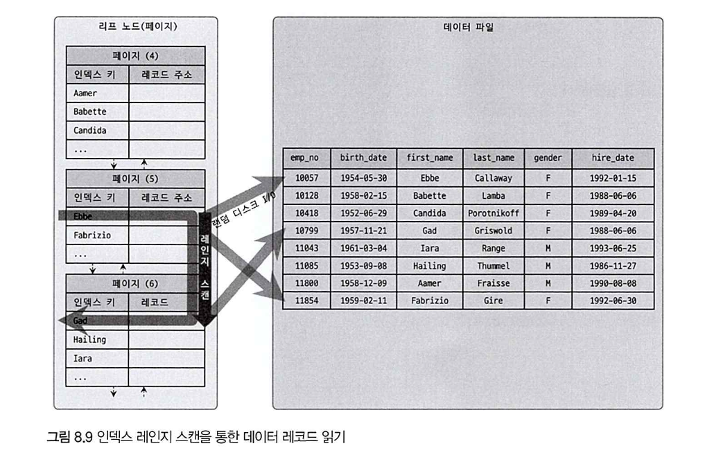
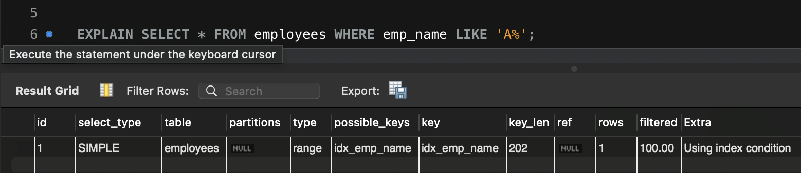
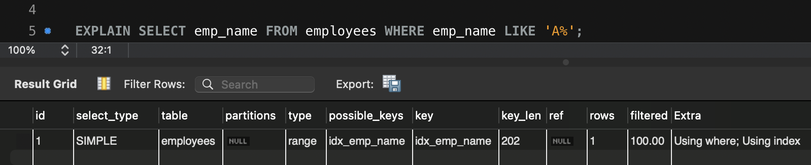
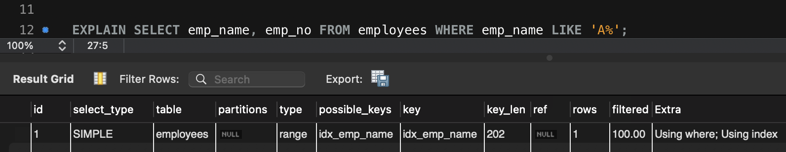
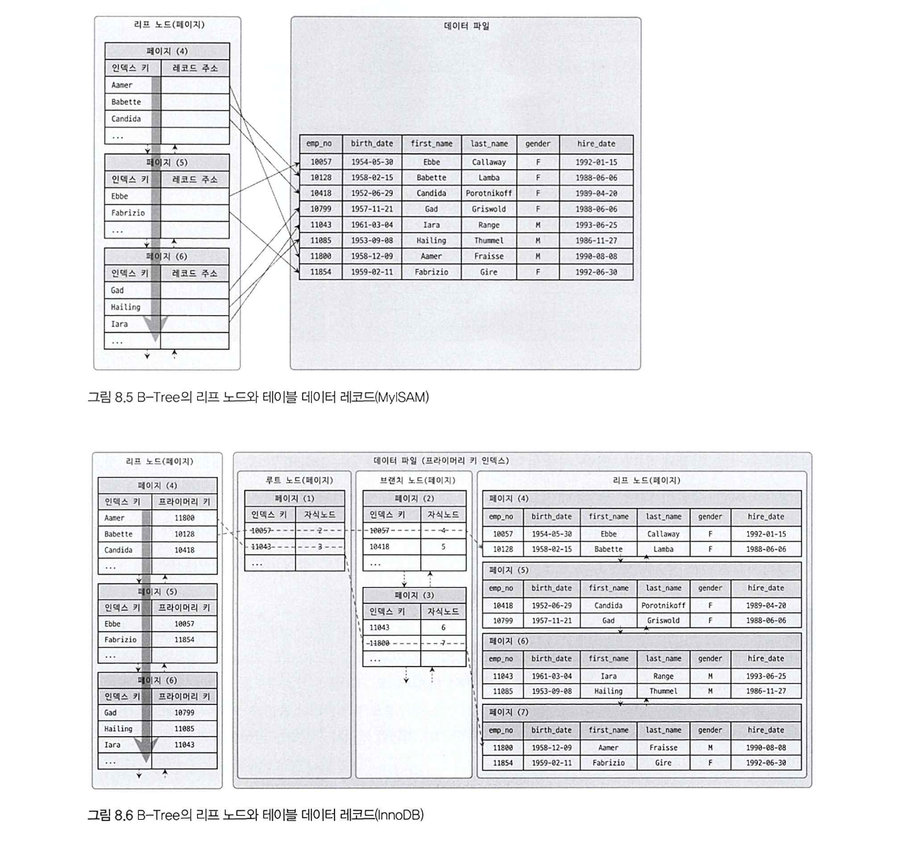
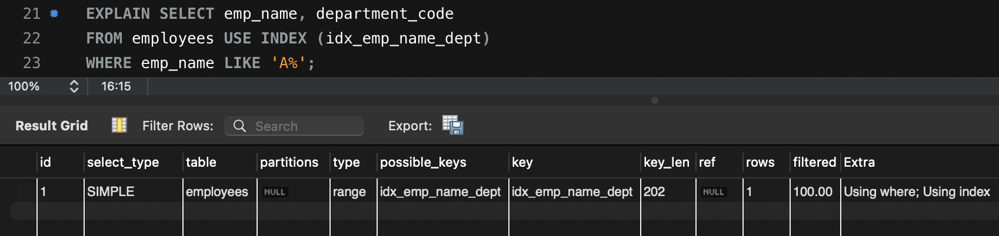
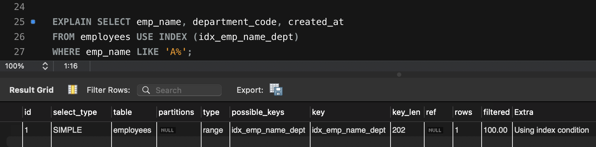
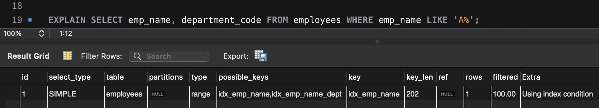

# Covering Index

## 학습 목표

- 커버링 인덱스의 개념과 적용 조건을 이해한다.
- InnoDB 세컨더리 인덱스 구조와 커버링 인덱스의 연관성을 이해한다.
- 복합 인덱스를 활용한 커버링 인덱스 설계 방법을 안다.

---

### MySQL이 인덱스를 이용하는 방법

어떤 경우에 인덱스를 사용하게 유도할지, 또는 사용하지 못하게 할지 판단하려면, MySQL이 어떻게 인덱스를 이용(경유)해서 실제 레코드를 읽어 내는지 알아야 한다.

MySQL이 인덱스를 이용하는 방법은 세 가지(인덱스 레인지 스캔, 인덱스 풀 스캔, 루스 인덱스 스캔)가 있다.

### 인덱스 레인지 스캔

인덱스 레인지 스캔은 검색 범위가 결정됐을 때 사용되는 방식으로, 가장 일반적이고 빠른 인덱스 접근 방식이다.

```sql
SELECT *
FROM employees
WHERE first_name BETWEEN 'Ebbe' AND 'Gad'
```



B-Tree를 루트부터 탐색해 시작 위치를 찾고, 거기서부터 리프 노드를 순서대로 읽어 나간다.
인덱스는 이미 정렬된 구조이기 때문에, 별도의 정렬 없이도 결과가 정렬된 상태로 나온다.

크게 3단계로 나눌 수 있다.

1. **인덱스 탐색(index seek)**: 조건을 만족하는 값이 저장된 위치를 찾는다.
2. **인덱스 스캔(index scan)**: 탐색된 위치부터 필요한 만큼 인덱스를 순서대로 읽는다.
3. **레코드 읽기**: 읽어 들인 인덱스 키와 레코드 주소로 실제 데이터 파일에서 레코드를 가져온다.

3단계에서는 레코드 한 건마다 랜덤 I/O가 한 번씩 발생한다.
인덱스는 알파벳순으로 정렬되어 있지만, 데이터 파일의 물리적 저장 순서는 다르기 때문이다.
그래서 위 그림처럼 화살표가 여기저기 튀게 된다.

쿼리에 따라 **3번 과정이 필요 없는 경우**가 있는데, 이를 **커버링 인덱스**라고 한다.

커버링 인덱스로 처리되는 쿼리는 디스크의 레코드를 읽지 않아도 되기 때문에 랜덤 읽기가 상당히 줄어들고, 성능은 그만큼 빨라진다.

---

## Covering Index란?

인덱스가 쿼리에 필요한 모든 컬럼을 가지고 있어서, 실제 데이터 파일을 읽지 않아도 되는 경우를 `커버링 인덱스(Covering Index)`라 한다.

즉, 앞서 본 3단계 중 3번(데이터 파일에서 레코드를 읽어오는 과정)이 생략되는 것이다.

## 실습: 커버링 인덱스 적용 여부 확인

employees 테이블에는 10만 건의 데이터가 들어있고, `emp_no`(PK)와 `emp_name`에 각각 인덱스가 걸려 있다.

먼저, 아래 쿼리를 실행해 보자.

```sql
EXPLAIN
SELECT *
FROM employees
WHERE emp_name LIKE 'A%';
```



`Extra`에 `Using index`가 없다.

**`emp_name` 외의 컬럼이 필요하기 때문에 테이블 레코드를 읽어야 한다.**

> **`Using index condition`은 무엇일까?**
>
> ICP(Index Condition Pushdown)가 적용됐을 때 표시된다.
> WHERE 조건 중 인덱스 컬럼만으로 판단할 수 있는 부분을, 테이블을 읽기 전에 스토리지 엔진 단에서 먼저 걸러내는 최적화다.
>
> ICP가 없으면 MySQL은 인덱스로 범위를 찾은 뒤, 조건에 맞는지 검사하기 위해 무조건 테이블 레코드를 읽어온다.
>
> ICP가 적용되는 경우, 예를 들어, `WHERE emp_name LIKE 'A%' AND emp_name LIKE '%son'` 같은 쿼리에서, `LIKE 'A%'`로 인덱스 범위를 찾은 뒤
`LIKE '%son'` 조건을 테이블 접근 전에 인덱스 값으로 먼저 걸러낸다.
> 조건을 통과한 행만 테이블에서 읽어오므로 테이블 접근 횟수가 줄어든다.
>
> ICP는 MySQL 8.0부터 기본으로 활성화되어 있다.
> `Using index condition`은 테이블 접근이 여전히 발생한다는 점에서 `Using index`(커버링 인덱스)와 다르다.

이번엔 `*`를 `emp_name`으로 바꿔보자.

```sql
EXPLAIN
SELECT emp_name
FROM employees
WHERE emp_name LIKE 'A%';
```



`Extra`에 `Using where; Using index`가 뜬다. **커버링 인덱스가 적용된 것이다.**

스토리지 엔진이 `idx_emp_name` 인덱스 값을 MySQL 엔진으로 넘겨주고(테이블 레코드는 안 읽음),
MySQL 엔진이 넘겨받은 값에 `LIKE 'A%'` 조건을 검사해 필터링한다.

즉, **디스크의 실제 레코드를 읽지 않고도 쿼리 결과를 얻어낸 것**이다.

`emp_name`과 `emp_no`를 함께 조회하면 어떻게 될까?



이번에도 `Using where; Using index`가 뜬다. `key`를 보면 `idx_emp_name`만 사용했다.

**`idx_emp_name`은 `emp_name`으로만 만든 인덱스인데, 어떻게 `emp_no`까지 가져올 수 있었을까?**

---

## InnoDB 구조와 커버링 인덱스

답은 InnoDB가 세컨더리 인덱스를 저장하는 방식에 있다.



위 그림을 보면 MyISAM과 InnoDB의 차이가 명확하다.

- **MyISAM**: 세컨더리 인덱스 리프 노드에 **레코드 주소**를 저장한다. 주소로 데이터 파일에 바로 접근한다.
- **InnoDB**: 세컨더리 인덱스 리프 노드에 **PK 값**을 저장한다. PK로 클러스터링 인덱스를 한 번 더 거쳐서 실제 레코드를 읽어온다.

InnoDB 테이블에서 세컨더리 인덱스가 실제 레코드가 저장된 주소를 가지고 있다면 어떻게 될까?

클러스터링 키 값이 변경될 때마다, 데이터 레코드의 주소가 변경되고, 그때 마다 해당 테이블의 모든 인덱스에 저장된 주솟값을 변경해 줘야 할 것이다.

이런 오버헤드를 제거하기 위해, **InnoDB 테이블(클러스터링 테이블)의 모든 세컨더리 인덱스는 해당 레코드가 저장된 주소가 아니라, 프라이머리 키 값을 저장하도록 구현돼 있다.**

InnoDB가 한 단계 더 복잡하지만, 클러스터링 인덱스가 제공하는 장점이 더 크기 때문에, 성능 저하를 걱정하지 않아도 된다.

커버링 인덱스와의 연결은 여기서 나온다.

세컨더리 인덱스 리프 노드에 PK가 항상 포함되어 있으므로, **PK 컬럼은 인덱스에 별도로 추가하지 않아도 커버링 인덱스 설계에 자동으로 활용된다.**

그래서 `idx_emp_name`만 있어도 `SELECT emp_name, emp_no`가 커버링 인덱스로 처리될 수 있었던 것이다.

---

## 인덱스 적용 기준 정리

1. 쿼리에서 필요한 컬럼이 모두 인덱스에 포함되어 있을 때 커버링 인덱스가 적용된다. `SELECT *`는 모든 컬럼이 필요하기 때문에 커버링 인덱스가 적용되지 않는다.
2. 여러 컬럼 조회가 필요한 경우, 복합 인덱스로 여러 컬럼을 묶어서 커버링 인덱스로 활용할 수 있다.
3. 복합 인덱스(세컨더리 인덱스)를 생성하는 경우, PK는 자동으로 포함되니까 따로 추가하지 않아도 된다.

### 실습: 복합 인덱스 커버링 인덱스 적용

복합 인덱스를 생성하고, 커버링 인덱스가 적용되는지 확인해 보자.

```sql
CREATE INDEX idx_emp_name_dept ON employees (emp_name, department_code);
```

```sql
-- 커버링 인덱스 O: 인덱스에 포함된 컬럼만 조회
EXPLAIN
SELECT /*+ INDEX(employees idx_emp_name_dept) */ emp_name, department_code
FROM employees
WHERE emp_name LIKE 'A%';
```



```sql
-- 커버링 인덱스 X: 인덱스에 없는 created_at이 필요
EXPLAIN
SELECT /*+ INDEX(employees idx_emp_name_dept) */ emp_name, department_code, created_at
FROM employees
WHERE emp_name LIKE 'A%';
```



#### 옵티마이저는 컬럼 여러 개를 조회할 때, 늘 복합 인덱스를 사용할까?

앞선 복합 인덱스 커버링 인덱스 적용 실습에서, 다음과 같은 쿼리를 실행해 보자.

```sql
EXPLAIN
SELECT emp_name, department_code
FROM employees
WHERE emp_name LIKE 'A%';
```



`Extra`에 `Using index condition`이 뜬다.

`key`를 보면, `idx_emp_name` 인덱스가 적용된 것을 알 수 있다.

우리가 조회하고자 한 컬럼은 emp_name, department_code인데, 왜 옵티마이저는 복합 인덱스를 사용하지 않은 것일까?

옵티마이저 입장에서는 `emp_name LIKE 'A%'` 조건만 처리하는 데 `idx_emp_name`이 더 가볍다고 판단한 것이다.

이러한 경우, department_code는 인덱스에 없으니까 테이블을 읽어야 해서 커버링 인덱스가 되지는 않는다.

옵티마이저는 항상 최선의 인덱스를 선택하지 않을 수 있다.

옵티마이저는 비용(인덱스 크기, 읽어야 할 레코드 수 등)을 계산해서 더 효율적이라고 판단한 인덱스를 선택한다.

그렇기 때문에, **옵티마이저가 원하는 인덱스를 사용하게 하려면, `옵티마이저 힌트`를 통해 인덱스를 지정할 수 있다.**

```sql
EXPLAIN
SELECT /*+ INDEX(employees idx_emp_name_dept) */ emp_name, department_code
FROM employees
WHERE emp_name LIKE 'A%';
```

> `USE INDEX`도 동일한 역할을 하지만, MySQL 8.0.20부터 deprecated 예정이므로 옵티마이저 힌트 사용이 권장된다.
> 참고: [MySQL 공식 문서 - Index Hints](https://dev.mysql.com/doc/refman/8.0/en/index-hints.html)
